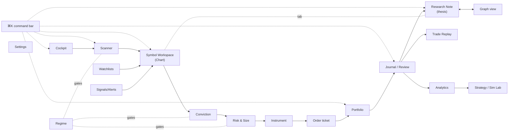

# Application Wireframes — Complete Atlas

Every screen, the navigation, and the trader's journey **from market scan to trade
review** — in the idiom of **TradingView × Bloomberg Terminal × Obsidian**, usability
first.

> **Status:** design (wireframes, no code). This is the **unifying atlas**: it adds the
> three-app design language, the global navigation/command model, the **chart workspace**
> and the **Obsidian research layer** (linked notes + graph), and maps *every* screen.
> The research-loop screens are detailed in **[DESKTOP_UX.md](DESKTOP_UX.md)**; per-feature
> wireframes live in [TRADE_REPLAY](TRADE_REPLAY.md), [CONVICTION_ANALYSIS](CONVICTION_ANALYSIS.md),
> [INSTRUMENT_SELECTION_UI](INSTRUMENT_SELECTION_UI.md), [STRATEGY_LAB](STRATEGY_LAB.md),
> [SIMULATION_LAB](SIMULATION_LAB.md). This doc references them, not re-draws them.

---

## 1. Design language — the three-app synthesis

| Borrowed from | What it contributes | Concrete features here |
|---|---|---|
| **TradingView** | the **chart is the analysis surface** | the Symbol Workspace (§5C): fast candlesticks, indicators, signal/entry/stop/MFE/MAE markers, multi-timeframe, drawing tools, watchlists, hotkey symbol-switching |
| **Bloomberg Terminal** | **density + command-driven speed** | the **command bar** (`AAPL ⏎`, `>scan`), function-style commands, multi-pane "launchpad" cockpit, tabular monospace numerics, regime/heat always in chrome, keyboard-first, color = meaning |
| **Obsidian** | **a linked research knowledge base** | notes on symbols/signals/trades/theses/regimes, **bidirectional links + backlinks**, the **graph view**, daily research notes, tags, split/stack panes, the ⌘K palette |

**One sentence:** *a TradingView chart and a Bloomberg command line, wrapped in an
Obsidian notebook* — so research **compounds** (every trade links to its thesis, signal,
regime and notes) instead of evaporating after the trade closes.

Builds on DESKTOP_UX.md's dark/dense **design system** (palette, 28px tabular rows,
uPlot charts, ≤120ms motion) — not restated here.

---

## 2. Global chrome (one frame, everywhere)

```
┌─ command bar ─────────────────────────────────────────────────────────────────────────┐
│ ⌘K › NVDA█           type a symbol or  > command            ◆BULL ADX28 VIX14 · heat 3.2%│
├──┬───────────────────────────────────────────────────────────────────────────┬─────────┤
│N │  WORKSPACE  ── tabs ──  [ Chart·NVDA ][ Scanner ][ Journal ][ +note ]  ▭ split        │ I
│A │ ┌───────────────────────────────────────────────────────────────────────┐ │ INSPECTOR│
│V │ │                                                                         │ │ context: │
│  │ │                         active view / split panes                       │ │ conviction│
│r │ │                                                                         │ │ instrument│
│a │ │                                                                         │ │ notes /  │
│i │ │                                                                         │ │ backlinks│
│l │ └───────────────────────────────────────────────────────────────────────┘ │          │
├──┴───────────────────────────────────────────────────────────────────────────┴─────────┤
│ ● backend ok · run live-2024 ▾ · 412 symbols · last scan 09:32 · ● PAPER ◌LIVE🔒 · ?help │
└─────────────────────────────────────────────────────────────────────────────────────────┘
```

- **Command bar** (Bloomberg GO + Obsidian palette): bare text = symbol → Symbol
  Workspace; `>` = command. Always focusable with `⌘K`.
- **Left nav rail** = the screen map (§3); **right inspector** = persistent context for the
  current subject (conviction / instrument / risk / notes / backlinks).
- **Status bar** = system state (regime/heat are in the *top* bar because they gate every
  decision; run selector scopes all screens; Paper/Live target; Live is gated 🔒).

---

## 3. Navigation model

### Left-nav sections (grouped; numbers = keyboard jump)

```
WORK         1 Cockpit      2 Scanner     3 Watchlists   4 Signals/Alerts
SYMBOL       5 Chart workspace  (subject = the selected symbol; 6 Conviction 7 Instrument 8 Risk are its tabs)
MANAGE       P Portfolio    J Journal/Review     G Regime
RESEARCH     N Notes        ⌥G Graph      Σ Analytics
LABS         L Strategy Lab    M Simulation Lab    B Backtest
             ⚙ Settings
```

### Command vocabulary (the Bloomberg/Obsidian line)

```
AAPL                  → Symbol Workspace for AAPL (persistent subject)
>scan  >regime        → run/open scanner, regime
>conviction  >instr   → conviction / instrument for the current symbol
>size                 → risk & sizing for the current symbol
>paper  >live         → order ticket (live gated)
>journal  >replay 1042→ trade journal / replay trade #1042
>note "NVDA thesis"   → open/create a research note
>graph                → knowledge graph
>lab  >sim  >backtest → labs
[[                    → link-autocomplete inside a note (symbol/trade/thesis/regime)
```

### Interaction rules (usability-first)
- **Persistent subject.** Pick a symbol once (Scan/command bar/watchlist); Conviction,
  Instrument, Risk, Replay, Notes all follow it. `[`/`]` step through the candidate set.
- **Panes, not modals.** Split (chart ▮ conviction) or stack (note ▮ its linked trade);
  drilling replaces the detail or opens a split — never a dialog stack.
- **Everything links.** Symbol · signal · trade · thesis · regime · note are entities with
  **backlinks**; the inspector's *Backlinks* tab shows "what references this".
- **Keyboard-first.** `⌘K` palette · `1‥8`/letters jump · `j/k`+`⏎` table nav · `/` filter ·
  `[ ]` prev/next symbol · `?` shortcuts · `esc` back.

### Screen map



---

## 4. Screen atlas

Hero/new screens are drawn here; pipeline screens already drawn elsewhere are summarized
with a cross-reference so the atlas is complete without duplication.

### A · Cockpit (launchpad)  — Bloomberg multi-panel + TradingView watchlist + Obsidian recents

```
┌ Cockpit ───────────────────────────────────────────────── 09:41  ◆ BULLISH (ADX 28) ──┐
│ ┌ Regime ───────────┐ ┌ Watchlist ★ ──────────────┐ ┌ Today's top signals ───────────┐ │
│ │ BULL · uptrend     │ │ NVDA  98.5 +2.1% ▇ 92◆E   │ │ NVDA  entry  92◆E  spread  ▸    │ │
│ │ breadth 64% ▇▇▇▇▆  │ │ AAPL 185.2 +0.4% ▅ 78◆H   │ │ SMCI  entry  71◆H  call    ▸    │ │
│ │ VIX 14 · SPY>200d  │ │ SMCI 640.0 +3.8% ▇ 71◆H   │ │ AAPL  entry  78◆H  shares  ▸    │ │
│ │ ▸ open Regime      │ │ XOM  104.1 -0.3% ▂ 44◦M   │ │ … 7 new since 09:32   ▸ Scanner │ │
│ └────────────────────┘ └────────────────────────────┘ └─────────────────────────────────┘ │
│ ┌ Open positions · heat 3.2% / 6.0% ─────────────┐ ┌ Equity ─────┐ ┌ Recent notes ─────┐ │
│ │ NVDA L +3.6R  ████  stop 138  trail            │ │   ╱‾‾╲╱      │ │ • NVDA thesis  2h │ │
│ │ AAPL L +0.4R  ▆     stop 178                   │ │ ╱╱           │ │ • Semis regime 1d │ │
│ │ MSFT L -0.2R  ▂     stop 402                   │ │ +18% YTD     │ │ • Weekly 2024-W24 │ │
│ └─────────────────────────────────────────────────┘ └─────────────┘ └────────────────────┘ │
│ ⚠ alerts (2): NVDA +1R → breakeven moved · MRNA stop hit −1.0R                            │
└────────────────────────────────────────────────────────────────────────────────────────────┘
```

### B · Scanner (market scan) — master-detail
Ranked breakout candidates (rank · symbol · sparkline · momentum · **conviction badge** ·
RVOL · dist-ATH · sector RS · gates) with a hover-prefetch inspector (conviction +
opportunity + instrument + risk in one glance). **Full wireframe: DESKTOP_UX.md §1–2.**

```
│ # Sym  ▆chart  Mom  Conv   RVOL  dATH  Sector   │  INSPECTOR: NVDA
│ 1 NVDA ▇▇▆     0.95 92◆E   1.8×  -2%   Semis.86  │  conviction 92 ◆E · opp ★ · spread
│ 2 SMCI ▇▆▇     0.89 71◆H   2.4×  -5%   Semis.86  │  size 1.0% · stop 92 · instr spread ▸
│ 3 AAPL ▅▅▆     0.74 78◆H   1.2×  -1%   Tech .71  │  [ open chart ⏎ ]  [ ★ ]  [ x ]
```

### C · Symbol Workspace (the TradingView hero) — chart + tabs + inspector

```
┌ NVDA · NVIDIA · LONG setup ──────────── 1D ▾  [Chart][Conviction][Instrument][Analogs][Notes]┐
│ ┌ Price ─────────────────────────────────────────────────────────────────┐ ┌ Inspector ──┐ │
│ │  150┤                                       ◆exit?  ╱‾‾                  │ │ Conviction  │ │
│ │     │                        ◇MFE 148   ╱‾‾╲___╱                         │ │   92 ◆E     │ │
│ │  120┤                  ╱‾‾╲╱‾                                            │ │ Size  1.0%  │ │
│ │     │      ▲entry 98.5  ╱        breakout of 50d high (96.2)             │ │   120sh     │ │
│ │   95┤ ···· stop 92.0 (2.5ATR, trail) ·····················               │ │   stop 92   │ │
│ │     │  EMA20▔ EMA50▔ EMA200▔   vol ▁▂▅▇▃▂▅   RSI 64  ADX 31              │ │ Instrument  │ │
│ │     └──────────────────────────────────────────────────────────▶ time   │ │  95/115     │ │
│ │  tools: ╱ trend  ▭ box  ⊹ fib  🔔 alert      tf: 1D 1W 1H               │ │  spread ▸   │ │
│ └──────────────────────────────────────────────────────────────────────────┘ │ Backlinks   │ │
│  signal #1042 · 2024-01-04 · momentum .95 · rvol 1.8× · regime BULL           │  2 notes ▸  │ │
│  [ analyze conviction → ]   [ size & instrument → ]   [ +thesis note ]         │             │ │
└────────────────────────────────────────────────────────────────────────────────────────────┘
```
Tabs swap the main pane: **Conviction** = [CONVICTION_ANALYSIS.md] · **Instrument** =
[INSTRUMENT_SELECTION_UI.md] · **Analogs** = DESKTOP_UX §4 · **Notes** = §4M.

### D · Conviction (why the score) — cross-ref
Score gauge + 8 contributing factors + market context + recommended size + instrument +
plain-English rationale. **Full wireframe: [CONVICTION_ANALYSIS.md](CONVICTION_ANALYSIS.md).**

### E · Instrument Selection — cross-ref
Four candidates (shares/call/spread/LEAPS) side-by-side with liquidity/OI/IV/DTE/risk.
**Full wireframe: [INSTRUMENT_SELECTION_UI.md](INSTRUMENT_SELECTION_UI.md).**

### F · Risk & Sizing

```
┌ Risk & Size · NVDA · LONG ──────────────────────────────────────────────────────────────┐
│ Conviction EXTREME → risk 1.0% (base 0.75% ×1.33)   Equity $100,000 → 1R = $1,000         │
│ Entry 98.5  Stop 92.0 (2.5·ATR, $6.50/sh)  →  Shares 120 · $11,820 · 11.8% eq             │
│ ┌ Gateway checks ─────────────────────────────────────────────────────────────────────┐  │
│ │ per-name ≤20% ✓   sector ≤35% ✓ (Semis 22%)   correlation ✓ (max 0.55)               │  │
│ │ portfolio heat 3.2% +0.75% = 3.95% ≤ 6% ✓     max positions 6/12 ✓   circuit ✓        │  │
│ └──────────────────────────────────────────────────────────────────────────────────────┘  │
│ VERDICT  ✓ APPROVE 120 sh   [ stage order → ]   [ override ▾ (logged) ]                    │
└────────────────────────────────────────────────────────────────────────────────────────────┘
```

### G · Order Ticket (paper / live)

```
┌ Order · NVDA ──────────────── ● PAPER ◌ LIVE 🔒 ─┐
│ Buy 120 sh @ market   ($11,820)   stop 92.0       │
│ or  5× 95/115 call spread  debit $720             │
│ time-in-force DAY · est. slippage 5bps            │
│ ▸ creates linked thesis note "NVDA 2024-01-04"    │
│ [ confirm ⏎ ]   [ cancel esc ]                    │
└────────────────────────────────────────────────────┘
```

### H · Watchlists (TradingView-style)

```
┌ Watchlists  [ ★ Core ][ Breakouts ][ Shortlist ][ + ] ──────────────────────────────────┐
│ Sym   Last     Chg%   ▆20d    Conv   Regime  RVOL  Note │  drag to reorder · ⏎ chart      │
│ NVDA  98.50   +2.1%  ▇▇▆     92◆E   bull    1.8×  ●     │  right-click ▸ add alert / note │
│ SMCI 640.00   +3.8%  ▇▆▇     71◆H   bull    2.4×        │                                  │
│ AAPL 185.20   +0.4%  ▅▅▆     78◆H   bull    1.2×  ●     │                                  │
└────────────────────────────────────────────────────────────────────────────────────────────┘
```

### I · Signals & Alerts feed

```
┌ Signals (live) ─────────────────┐ ┌ Alerts ──────────────────────────────┐
│ 09:32 NVDA entry  92◆E  ▸        │ │ ⚠ NVDA +1R → stop to breakeven        │
│ 09:32 SMCI entry  71◆H  ▸        │ │ ⚠ MRNA stop hit −1.0R (closed)        │
│ 09:31 AAPL entry  78◆H  ▸        │ │ 🔔 XOM crossed 50d high               │
│ 09:18 KO    exit  signal ▸       │ │ + new alert: price / R / conviction   │
└──────────────────────────────────┘ └────────────────────────────────────────┘
```

### G(2) · Regime · K · Portfolio · Σ Analytics
Regime: index chart with bull/bear shading + breadth/ADX/VIX history. Portfolio:
positions, equity curve, exposure, **heat gauge**, sector allocation, P&L. Analytics:
expectancy · profit factor · **R-multiple distribution** · drawdown · attribution by
regime/sector/setup. (Existing renderer views; summarized in DESKTOP_UX §7.)

### J · Journal / Trade Review — the *review* end of the loop

```
┌ Journal ──────── filter: [ Winners ][ Losers ][ Best setups ][ Longest ] ── sort R ▾ ────┐
│ Sym  Entry→Exit      Held  R     Net      Conv  Regime  Exit     Thesis note   │  REVIEW:  │
│ NVDA 01/04→02/12     27d  +3.6R  +$9,240  92◆E  bull    trail    "NVDA…" ●     │  #1042 ▸  │
│ NVDA replay ▸  ◇MFE +5.0R  ◇MAE −0.9R  ┊ entry▲ ─── trail ─── exit◆            │           │
│ AAPL 01/02→01/18     12d  +3.1R  +$4,100  78◆H  bull    trail    "AAPL…" ●     │           │
│ XOM  01/03→01/05      2d  −1.0R   −$750   44◦M  neut    stop     —             │           │
└────────────────────────────────────────────────────────────────────────────────────────────┘
```
A row expands to the **Trade Replay** (bar-by-bar, MFE/MAE/stop markers) — full wireframe
**[TRADE_REPLAY.md](TRADE_REPLAY.md)** — beside the **linked thesis note** (what I expected
vs. what happened). Filters = the required largest winners / losers / best setups / longest.

### M · Research Notes (Obsidian core) — linked thesis + backlinks

```
┌ Note · "NVDA 2024-01-04 thesis"  [edit][preview]  tags: #breakout #semis #bull ──────────┐
│ # NVDA — 50d breakout                                                                     │
│ Thesis: breakout of [[50d high]] on 1.8× rvol, [[Semiconductors]] RS top-15%, regime      │
│ [[BULL]]. Conviction [[Signal #1042]] = 92 (EXTREME). Sized 1.0% via [[Risk budget]];     │
│ chose a [[95/115 call spread]] (IV/RV 1.3 rich).                                          │
│ Outcome: closed +3.6R on [[Trade #1042]] (trailing stop) — see replay.                    │
│ Lesson: trail held the move; entry could've been 1 bar earlier.                           │
├──────────────────────────────────────────────────────────────── Backlinks (4) ───────────┤
│ ← Trade #1042 · Signal #1042 · Semiconductors (sector note) · Weekly 2024-W24             │
└────────────────────────────────────────────────────────────────────────────────────────────┘
```
`[[` autocompletes links to symbols, signals, trades, regimes and other notes. **Daily
note** (`2024-01-04`) auto-collects the day's scans/trades; the **Weekly research report**
(existing module) is a generated note.

### ⌥G · Graph view (Obsidian) — the research web

```
┌ Graph ───────────────────────────────────────────────── filter: tags ▾  depth 2 ▾ ──────┐
│            (Semiconductors)───(NVDA)═══(Trade #1042)───(NVDA thesis)                       │
│                  │               │           │              │                             │
│              (Sector RS)     (Signal #1042)─(Conviction 92)  (Weekly W24)                  │
│                                  │                                                         │
│              (BULL regime)──────(Breadth)        node size = links · color = type          │
│  hover a node ▸ preview · click ▸ open · drag to explore the trade's full lineage          │
└────────────────────────────────────────────────────────────────────────────────────────────┘
```

### L/M/B · Labs & ⚙ Settings — cross-ref
**Strategy Lab** [STRATEGY_LAB.md] · **Simulation Lab** [SIMULATION_LAB.md] · **Backtest**
(configure▸run▸results, DESKTOP_UX §5). **Settings:** data providers, risk/strategy/
conviction config (validated), appearance, keyboard map, **backups & logs** (ties to
[DEPLOYMENT.md] / [SYSTEM_LOGGING.md]).

### ⌘K · Command palette (overlay)

```
┌ ⌘K ──────────────────────────────────────────┐
│ nvda█                                          │
│ ▸ NVDA — open Symbol Workspace                 │
│ ▸ NVDA — conviction analysis                   │
│ ▸ NVDA thesis — note                           │
│ ▸ > run scan        > replay 1042              │
│ ▸ > simulation lab  > settings risk            │
└────────────────────────────────────────────────┘
```

---

## 5. The trader's journey — market scan ▸ trade review

```mermaid
flowchart LR
    A["1 Cockpit\nregime + alerts"] --> B["2 Scanner\nbreakouts by conviction"]
    B --> C["3 Symbol Workspace\nstudy the chart"]
    C --> D["4 Conviction\nwhy the score"]
    D --> E["5 Risk & Size + Instrument\nhow much · which structure"]
    E --> F["6 Order ticket\nstage (paper/live)\n+ auto thesis note"]
    F --> G["7 Portfolio\nmanage stops/heat/alerts"]
    G --> H["8 Journal\ntrade closes → review"]
    H --> I["9 Trade Replay\nbar-by-bar: MFE/MAE/exit"]
    I --> J["10 Annotate note\nlesson → Graph links"]
    J --> K["11 Analytics + Labs\nexpectancy → refine"]
    K -. next idea .-> B
```



| Step | Screen | Keys | What the trader does |
|---|---|---|---|
| 1 | Cockpit | `1` | Glance: regime BULL, heat 3.2%, alerts, open positions |
| 2 | Scanner | `2`/`>scan` | Filter breakouts, sort by conviction, skim with `j/k` |
| 3 | Symbol Workspace | `⏎`/`AAPL` | Study the breakout on the chart (entry/stop/MFE context) |
| 4 | Conviction | `6` tab | Read *why* 92/EXTREME — the 8 factors + rationale |
| 5 | Risk & Instrument | `8`/`7` | Approve 1.0% size (120 sh); pick the 95/115 spread |
| 6 | Order ticket | `>paper` | Stage to paper; a **thesis note** is created + linked |
| 7 | Portfolio | `P` | Position live; trail stop; breakeven alert at +1R |
| 8 | Journal | `J` | On close, the trade lands in the review list |
| 9 | Trade Replay | `replay` | Replay the move bar-by-bar; see MFE/MAE vs. the exit |
| 10 | Note + Graph | `N`/`⌥G` | Write the lesson; backlinks weave it into the research web |
| 11 | Analytics / Labs | `Σ`/`L` | Confirm expectancy/PF; tune in the Strategy/Sim Lab |

The loop **closes back to the scanner** — each pass leaves a linked, searchable record, so
the eleventh trade is informed by the first ten.

---

## 6. Usability principles (first)

1. **One subject, everywhere.** Pick a symbol once; every panel follows it. No re-typing.
2. **Keyboard or mouse, never required-both.** Command bar + palette + `j/k`/`[ ]`/`?`.
3. **Glanceable density.** Tabular monospace numbers, micro-sparklines, color only for
   meaning (regime · R sign · conviction band). Bloomberg density, TradingView legibility.
4. **The chart is the analysis surface**; the inspector is the context; the note is the memory.
5. **Progressive disclosure.** Overview (Cockpit/Scanner) → inspector (one glance) → full
   screen (Workspace/Replay). Never a modal stack.
6. **Research compounds.** Every trade is linked to its thesis, signal, regime and notes;
   the graph makes the web explorable. Nothing is lost after the exit.
7. **Local-first & fast.** SQLite sidecar, prefetch-on-hover, virtualized tables, ≤120ms
   transitions, offline-capable (per DESKTOP_APP.md / DEPLOYMENT.md).
8. **Safety in the chrome.** Regime + heat + Paper/Live always visible; Live gated; every
   override logged (SYSTEM_LOGGING.md).

---

## 7. Cross-references & self-critique

**Composes existing designs:** DESKTOP_UX.md (research-loop screens, design system),
TRADE_REPLAY / CONVICTION_ANALYSIS / INSTRUMENT_SELECTION_UI / STRATEGY_LAB / SIMULATION_LAB
(per-feature wireframes), DESKTOP_APP / DEPLOYMENT / SYSTEM_LOGGING (shell, packaging, logs).
This atlas is the **navigation + design-language + complete-screen** layer over them.

**Self-critique**
- **Two UX docs** (this + DESKTOP_UX.md) risk drift; this is explicitly the *atlas/navigation*
  layer and references DESKTOP_UX for the pipeline-screen detail — they should be merged or
  one made canonical before build.
- **Density vs. approachability.** A Bloomberg-dense, keyboard-first UI is fast for the power
  user but steep for newcomers — mitigate with the `?` overlay, command-bar discoverability,
  and sensible defaults; a "calm mode" (fewer columns) is a possible toggle.
- **The Obsidian layer is new surface area** (notes, links, graph, daily/weekly notes) — it
  needs a notes data model + backlink index; high research value, but scope it as its own
  phase, not a v1 blocker.
- **Charting** is the heaviest component; reuse a uPlot-class renderer (DESKTOP_UX design
  system), not a from-scratch chart.
- **No code generated** — this is the wireframe/IA approval gate the request asked for before
  implementation.
