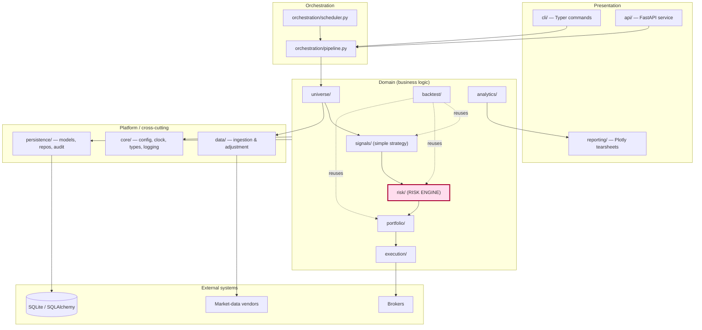
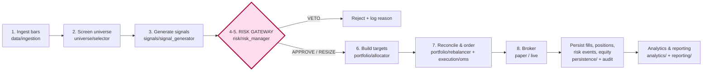
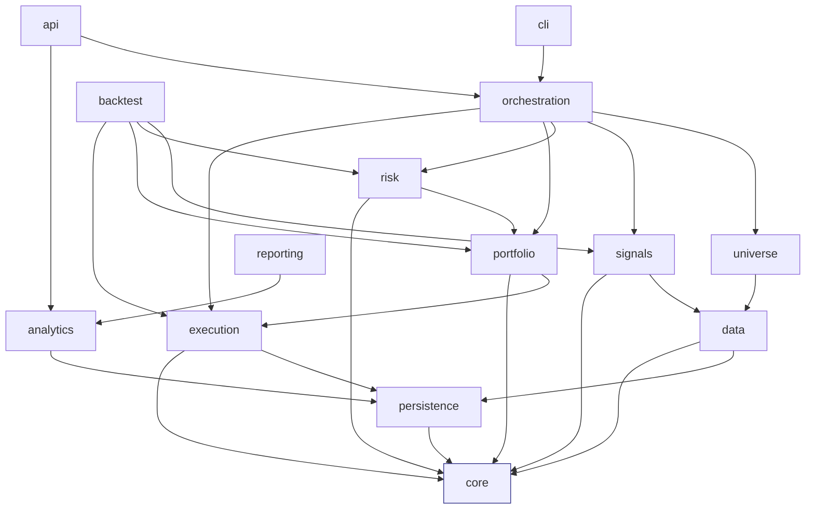
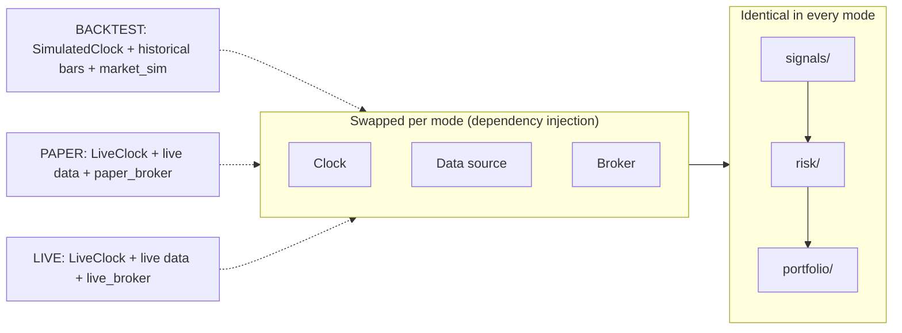
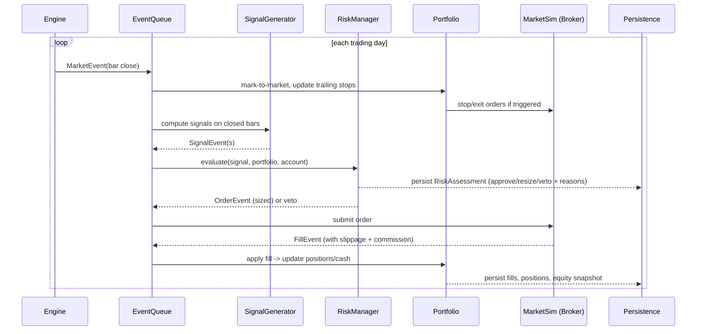

# Architecture — Momentum Research Platform (MRP)

A systematic **momentum-breakout** research and trading platform for US equities.

> **Status:** Architecture / scaffold only. No business logic is implemented yet.
> This document is the authoritative map of *what* each part does and *why*.

---

## 1. Design philosophy

| Principle | How the architecture enforces it |
|---|---|
| **Simple strategy** | All signal logic lives in one small package (`signals/`). It only ever emits *"enter/exit this symbol now"* — no sizing, no risk. |
| **Sophisticated risk** | A single, central **risk engine** (`risk/`) owns *all* sizing, stops, exposure, correlation, heat, drawdown and hard limits. Every order must pass its gateway. |
| **Data driven** | Every input is versioned data (bars, configs) and every decision is persisted. Nothing is hard-coded; tunables live in `config/*.yaml`. |
| **Modular** | Strict layering and dependency rules (§5). Each concern is a replaceable package behind an interface (providers, brokers, sizing methods). |
| **Fully auditable** | Append-only audit log + a `runs` registry capturing config hash, code version and RNG seed. Any result can be reproduced and any trade explained. |

**The thesis:** edge comes from *risk management and position sizing*, not from prediction. A simple breakout with disciplined R-multiples, dynamic sizing and hard loss controls is the target — capturing infrequent large trend moves while strictly bounding the downside on every trade.

---

## 2. The objective, mapped to modules

The eight required capabilities map one-to-one onto packages:

| # | Objective | Owning package |
|---|---|---|
| 1 | Scan US equities | `data/` + `universe/` |
| 2 | Find momentum breakouts | `signals/` |
| 3 | Evaluate risk | `risk/` |
| 4 | Size positions dynamically | `risk/position_sizing.py` |
| 5 | Hold trades for days–weeks | `signals/` (channel/time exits) + `risk/stops.py` (trailing) |
| 6 | Capture large trend moves | trailing-stop + let-winners-run exit policy in `risk/` |
| 7 | Collect performance statistics | `analytics/` + `reporting/` + `persistence/` |
| 8 | Support live execution | `execution/` + `core/clock.py` (one code path for all modes) |

---

## 3. System layers



The **risk engine is highlighted** because it is the architectural centerpiece: it sits on the critical path between *signal* and *order*, and nothing reaches a broker without its approval.

---

## 4. The trading pipeline (data flow)

The end-of-day flow. Each stage is a pure-ish function consuming typed objects from `core/types.py` and emitting the next, so it is independently testable and individually persisted.



**Look-ahead discipline:** signals are computed on *closed* bars only; the `core.clock` abstraction guarantees the same temporal rules in backtest and live.

---

## 5. Module dependency rules

Dependencies point **downward only**. Lower layers never import higher ones; this keeps the domain pure and the platform swappable.



**Rules**
- `core/` depends on nothing internal (no cycles, ever).
- `signals/` cannot import `risk/`, `portfolio/`, or `execution/` — the strategy is blind to sizing/money. This is enforced by code review and (later) an import-linter check.
- `risk/` is the *only* package allowed to decide quantity, stops and whether a trade happens.
- Everything talks to the outside world (vendors, brokers, DB) through interfaces, never concrete vendors.

---

## 6. One code path for backtest, paper and live

A core requirement (#8) is that research and live trading share the same logic. We achieve this by injecting three swappable adapters; the entire `signals → risk → portfolio` core is identical in every mode.



| Mode | Clock | Data source | Broker |
|---|---|---|---|
| Backtest | `SimulatedClock` | historical bars | `backtest/market_sim` |
| Paper | `LiveClock` | live feed | `execution/paper_broker` |
| Live | `LiveClock` | live feed | `execution/live_broker` |

Because only the *edges* change, a strategy that backtests well runs in paper and live with zero logic changes — and slippage/commission models are shared between the backtester and the paper broker so simulated results stay honest.

---

## 7. Backtest event loop

The backtester is **event-driven** (not vectorized) so it exercises the exact same `risk_manager` and `portfolio` objects used live, eliminating backtest/live divergence.



Determinism is guaranteed by a fixed RNG seed (recorded in the `runs` table) and strict bar-close ordering.

---

## 8. Module catalog

Every module, its responsibility, and its key collaborators. (Each stub file on disk carries the same description in its docstring.)

### `core/` — cross-cutting primitives
| Module | Purpose |
|---|---|
| `config.py` | Typed, validated config (Pydantic) from YAML + env; immutable; hashed for reproducibility. |
| `logging.py` | Structured JSON logging tagged with `run_id` for full decision lineage. |
| `clock.py` | `Clock` protocol → `SimulatedClock` / `LiveClock`. The key to one-code-path and look-ahead safety. |
| `types.py` | Frozen dataclasses: `Bar`, `Signal`, `RiskAssessment`, `Order`, `Fill`, `Position`, `TargetPosition`, `AccountState`. |
| `enums.py` | `Side`, `OrderType`, `OrderStatus`, `SignalType`, `ExitReason`, `RunMode`, `RegimeState`. |
| `constants.py` | `TRADING_DAYS_PER_YEAR`, precision, epsilon. |
| `exceptions.py` | Domain exception hierarchy. |

### `data/` — market data
| Module | Purpose |
|---|---|
| `providers/base.py` | Abstract `MarketDataProvider` interface; vendors are interchangeable. |
| `providers/{alpaca,polygon,yfinance}.py` | Concrete vendor adapters (stubs). |
| `ingestion.py` | Orchestrates fetch → validate → adjust → persist; incremental & idempotent. |
| `corporate_actions.py` | Split/dividend adjustment → continuous, point-in-time-correct prices. |
| `calendar.py` | US trading calendar (sessions, holidays, early closes). |
| `bars.py` | OHLCV resampling / alignment / rolling-window assembly. |
| `cache.py` | Local cache (parquet/SQLite) for offline research and fewer vendor calls. |
| `validation.py` | Data-quality gates: gaps, spikes, non-positive prices, look-ahead guards. |

### `universe/` — what is tradeable
| Module | Purpose |
|---|---|
| `screener.py` | Apply price / liquidity / market-cap screens. |
| `filters.py` | Composable, individually-testable filter primitives. |
| `selector.py` | Point-in-time universe snapshots (survivorship-bias-free). |

### `signals/` — the simple strategy
| Module | Purpose |
|---|---|
| `indicators.py` | Vectorized ATR, SMA/EMA, ADX, ROC, RSI, volume z-score, Donchian channels. |
| `breakout.py` | N-day/Donchian high breakouts, volatility contraction, volume confirmation. |
| `momentum.py` | Time-series & cross-sectional momentum ranking (e.g. 12-1 ROC). |
| `regime.py` | Market-regime/trend filter (e.g. SPY > 200DMA) gating entries. |
| `signal_generator.py` | Combines the above into discrete, timestamped `Signal`s. **No sizing.** |

### `risk/` — the risk engine *(see [RISK_MANAGEMENT.md](RISK_MANAGEMENT.md))*
| Module | Purpose |
|---|---|
| `volatility.py` | ATR, EWMA/close-to-close realized vol, Parkinson/Yang-Zhang — the *unit of risk*. |
| `position_sizing.py` | signal + stop + equity → quantity (fixed-fractional-risk / vol-target / fractional-Kelly). |
| `stops.py` | Initial ATR stop, chandelier/trailing stop, breakeven, time stop — defines the `R` unit. |
| `exposure.py` | Gross/net/long caps and per-sector concentration limits. |
| `correlation.py` | Reject stacking correlated bets; cluster limits. |
| `drawdown.py` | Equity-curve throttle: de-risk as drawdown deepens, re-risk on recovery. |
| `heat.py` | Aggregate open risk ("heat") vs a hard ceiling. |
| `limits.py` | Declarative hard limits & circuit breakers (max positions, daily-loss kill-switch). |
| `risk_manager.py` | **The gateway.** `evaluate(...) → RiskAssessment {APPROVE/RESIZE/VETO}`; composes all of the above; single chokepoint; fully audited. |

### `portfolio/` — state & targets
| Module | Purpose |
|---|---|
| `portfolio.py` | Authoritative account state: cash, equity, positions, P&L. |
| `position.py` | Per-position lifecycle: avg price, stop, P&L, live R-multiple. |
| `allocator.py` | Approved+sized signals → concrete `TargetPosition`s. |
| `rebalancer.py` | Reconcile current vs target: entries, exits, stop updates, scale-outs. |

### `execution/` — orders to market
| Module | Purpose |
|---|---|
| `broker.py` | Abstract `Broker` interface (submit/cancel/positions/account). |
| `paper_broker.py` | Simulated broker for paper / live-shadow. |
| `live_broker.py` | Live broker adapter (e.g. Alpaca) (stub). |
| `order.py` | Order object & state machine. |
| `order_manager.py` | OMS: lifecycle, retries, reconciliation, idempotency keys. |
| `fills.py` | Fill capture & normalization. |
| `slippage.py` | Slippage & commission models (shared with the backtester). |

### `backtest/` — simulation
| Module | Purpose |
|---|---|
| `engine.py` | Deterministic event loop reusing live signal/risk/portfolio code. |
| `events.py` | `MarketEvent`/`SignalEvent`/`OrderEvent`/`FillEvent` + queue. |
| `market_sim.py` | Match orders against historical bars with slippage; strict bar-close (no look-ahead). |
| `walk_forward.py` | Walk-forward / out-of-sample robustness harness. |

### `analytics/` — performance stats
| Module | Purpose |
|---|---|
| `performance.py` | CAGR, vol, Sharpe, Sortino, Calmar, MAR. |
| `statistics.py` | Win rate, payoff, profit factor, expectancy (R), streaks. |
| `drawdown_analysis.py` | Depth/duration, time-to-recovery, underwater curve, ulcer index. |
| `trade_analysis.py` | R-multiple distribution, MAE/MFE, holding period, exit reason. |
| `attribution.py` | P&L by sector / regime / holding-bucket / signal type. |
| `metrics.py` | Registry: metric name → pure function (reproducible reporting). |

### `reporting/` — visualization
| Module | Purpose |
|---|---|
| `plots.py` | Plotly equity curve, underwater, R-distribution, rolling Sharpe. |
| `tearsheet.py` | Assemble a full HTML performance tearsheet. |
| `report_generator.py` | Per-run HTML/PDF reports embedding config + code version (audit). |

### `persistence/` — storage & audit *(see [DATA_MODEL.md](DATA_MODEL.md))*
| Module | Purpose |
|---|---|
| `database.py` | SQLAlchemy engine/session (SQLite WAL; swappable to Postgres). |
| `audit.py` | Append-only audit log of every material decision. |
| `models/` | One ORM model per table (instruments, bars, signals, risk_assessments, orders, fills, positions, trades, equity, risk_events, runs, …). |
| `repositories/` | Typed data-access objects; keep SQL out of business logic. |
| `migrations/` | Alembic schema versioning. |

### `api/` — service layer
| Module | Purpose |
|---|---|
| `app.py` | FastAPI app factory (routers, middleware, lifespan). |
| `dependencies.py` | DI providers (db session, config, services). |
| `schemas.py` | Pydantic request/response contracts (decoupled from ORM). |
| `services.py` | Business-facing service layer behind the routes. |
| `routes/` | `health`, `universe`, `signals`, `risk`, `portfolio`, `backtests`, `performance`. |

### `orchestration/` & `cli/`
| Module | Purpose |
|---|---|
| `orchestration/pipeline.py` | Wires the daily flow as composable stages. |
| `orchestration/scheduler.py` | Schedules EOD runs for paper/live; manual trigger for research. |
| `cli/main.py` | `mrp ingest | scan | backtest | report | paper-trade | serve`. |

---

## 9. Cross-cutting concerns

**Auditability.** Every signal, every risk verdict (including vetoes and the *reasons*), every order, fill, position change and limit breach is written to the database. The `audit.py` log is append-only. You can answer "why did we (not) take this trade, at this size, with this stop?" for any historical moment.

**Reproducibility.** Each run writes a row to `runs` capturing: run mode, the **config hash**, the **git commit**, all parameters, and the **RNG seed**. Given a `run_id`, the entire result is regenerable bit-for-bit.

**Configuration over code.** Strategy and risk behavior are data (`config/*.yaml`), not code. Changing risk-per-trade or a stop multiple is a config edit with a new hash — never a code change — so experiments are clean and comparable.

**Separation of secrets from tunables.** Credentials live only in `.env` (never committed). Strategy/risk knobs live in versioned `config/*.yaml`.

---

## 10. Repository layout

```
GamblingBot/
├── README.md
├── pyproject.toml            # packaging, tooling (ruff/mypy/pytest), `mrp` entry point
├── requirements.txt
├── Makefile                  # install / test / lint / serve / scan / backtest
├── .env.example              # secrets template (never commit real .env)
├── config/                   # versioned tunables (NOT secrets)
│   ├── settings.example.yaml
│   ├── universe.example.yaml
│   ├── strategy.example.yaml
│   └── risk.example.yaml     # the risk engine's control surface
├── docs/
│   ├── ARCHITECTURE.md       # this file
│   ├── RISK_MANAGEMENT.md    # risk engine deep dive
│   ├── DATA_MODEL.md         # schema + ERD
│   └── ROADMAP.md            # phased build plan
├── src/momentum/             # the installable package (src-layout)
│   ├── core/                 # config, logging, clock, types, enums, constants, exceptions
│   ├── data/                 # providers/, ingestion, corporate_actions, calendar, bars, cache, validation
│   ├── universe/             # screener, filters, selector
│   ├── signals/              # indicators, breakout, momentum, regime, signal_generator
│   ├── risk/                 # volatility, position_sizing, stops, exposure, correlation,
│   │                         #   drawdown, heat, limits, risk_manager
│   ├── portfolio/            # portfolio, position, allocator, rebalancer
│   ├── execution/            # broker, paper_broker, live_broker, order, order_manager, fills, slippage
│   ├── backtest/             # engine, events, market_sim, walk_forward
│   ├── analytics/            # performance, statistics, drawdown_analysis, trade_analysis, attribution, metrics
│   ├── reporting/            # plots, tearsheet, report_generator
│   ├── persistence/          # database, audit, models/, repositories/, migrations/
│   ├── api/                  # app, dependencies, schemas, services, routes/
│   ├── orchestration/        # pipeline, scheduler
│   └── cli/                  # main
├── tests/                    # unit/, integration/, fixtures/
├── notebooks/                # exploratory research only
├── scripts/                  # one-off ops scripts
├── data/                     # gitignored: raw/processed bars + momentum.db
├── reports/                  # gitignored: generated tearsheets
└── logs/                     # gitignored: structured logs
```

See **[ROADMAP.md](ROADMAP.md)** for the phased implementation order (data → signals → risk → backtest → analytics → execution → API).
