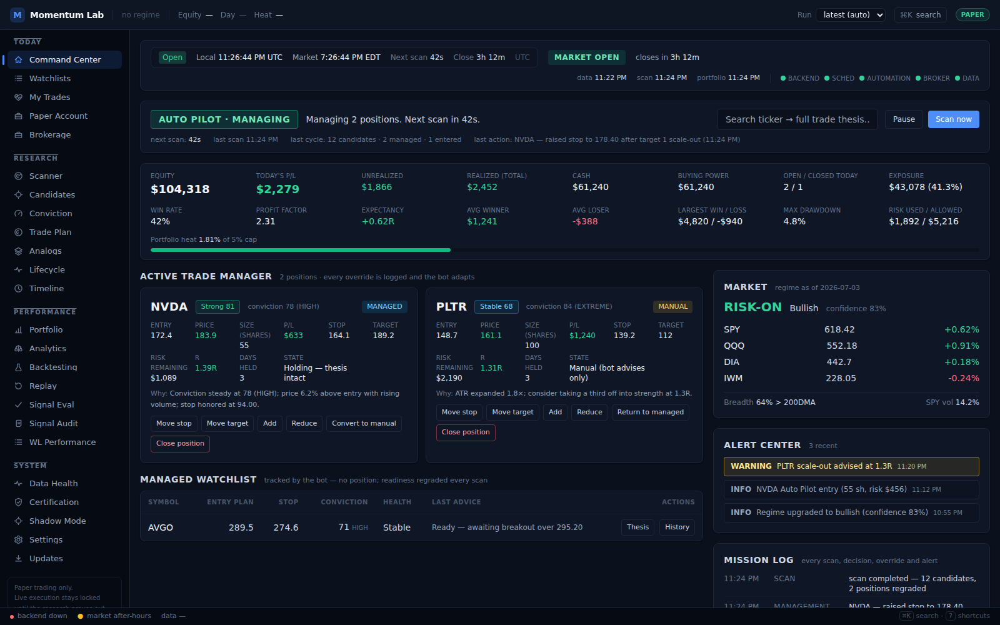
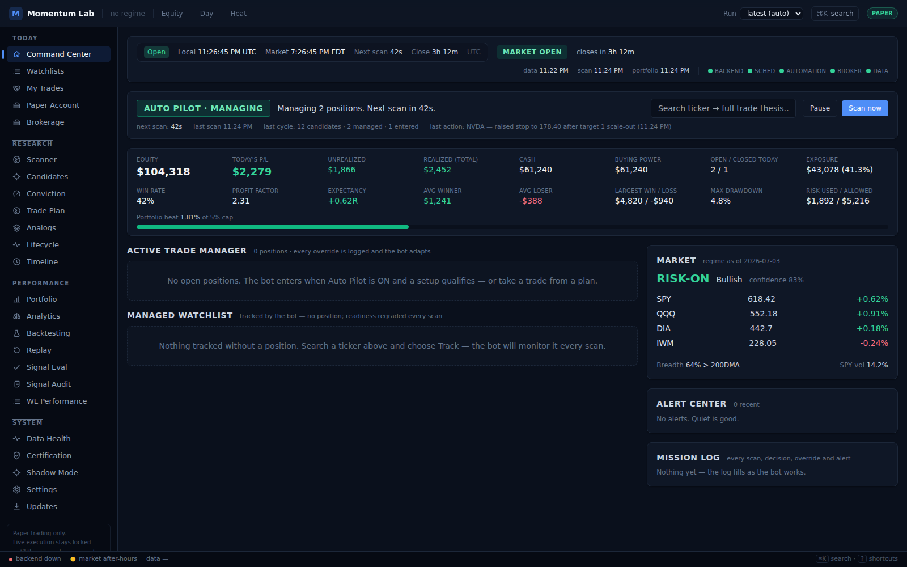

# Auto Pilot Trading Command Center

The default landing page rebuilt as a professional trading terminal. It is
designed to answer four questions within three seconds of looking at it:

1. **What is the market doing?** — top status bar + Market panel
2. **What is the bot doing?** — Auto Pilot hero strip
3. **What is my money doing?** — Account summary
4. **Do I need to intervene?** — Active Trade Manager, Alert Center, health lights

Every value on the screen is served by a live backend aggregate. Nothing is
fabricated in the renderer; unknown values are `null` on the wire and render
as `—`.

---

## 1. Screen anatomy

| Zone | Component | Backend source | Refresh |
|---|---|---|---|
| Top status bar | `TopStatusBar` | `GET /command-center/hud` (+ `LiveClock` on `/daemon/clock`) | 15 s |
| Auto Pilot hero | `AutopilotHero` | `GET /command-center/autopilot` | 10 s |
| Account summary | `AccountSummary` | `hud.account` | 15 s |
| Active Trade Manager | `TradeCard` grid | `GET /trade-lifecycle?status=open` (journal-linked rows) | 15 s |
| Managed watchlist | `ManagedWatchlist` | same endpoint (rows **without** a journal link) | 15 s |
| Market panel | `MarketPanel` | `hud.market` | 15 s |
| Alert center | `AlertCenter` | `GET /alerts?limit=14` | 20 s |
| Mission log | `MissionLog` | `GET /activity` merged with `GET /audit` | 20–30 s |
| Trade Plan Generator | `PlanSearch` / `PlanModal` | `GET /command-center/search`, `GET /tradeplan/{symbol}[/verdict]` | on demand |

### Top status bar
Local + market time (LiveClock, OS timezone/locale), market status chip
(PREMARKET / MARKET OPEN / AFTER HOURS / CLOSED) with the countdown to the
next open/close boundary, latest **data / scan / portfolio** timestamps, and
**five health lights** (backend, scheduler, automation, broker, data
provider) — each green/yellow/red with the exact reason in the tooltip
(`hud_service._health_lights`, derived from the daemon thread state, autopilot
settings, a live paper-venue account read, and the data-health service).

### Auto Pilot hero — what is the bot doing RIGHT NOW
`autopilot_service.status()` derives one state from live facts (daemon
running/paused/scanning flag, ET market clock, open managed book, autopilot
setting): `STOPPED / PAUSED / SCANNING / WAITING / MANAGING / RUNNING / IDLE`,
plus a plain-language activity line ("Managing 2 positions. Next scan in
42s."), the next scheduled action with countdown, the last completed cycle
(candidates / managed / entered / closed) and the last completed action from
the activity feed. Controls: **Pause / Resume** (`/daemon/pause|resume`),
**Scan now** (`/daemon/scan-now`), and the ticker search that opens the Trade
Plan Generator.

### Account summary — what is my money doing
`hud_service._account` derives every number from the paper journal + tracked
trade marks (scan-fresh, never invented): equity, cash, buying power, today's
P/L (realized + unrealized), unrealized, realized total, open/closed-today
counts, win rate, profit factor, expectancy (R), avg/largest winner & loser,
max drawdown, exposure ($ and %), risk used vs **max risk allowed** (the real
`RiskBudgetConfig.max_portfolio_heat` cap), and a portfolio-heat bar against
the 5 % cap. Only journal-linked tracked trades count as positions;
recommendation-only rows carry no money and are excluded.

### Active Trade Manager — do I need to intervene
One card per open position (`TradeCard`): ticker, health battery + score,
conviction, MANAGED/MANUAL badge, entry vs price, size, P/L, stop, next
target, **risk remaining**, unrealized R, days held, the current management
state and the **WHY** line (latest evaluation's action + first reason).

**User control surface** — every action posts to
`POST /trade-lifecycle/{uid}/override` (serialized by the trading mutex,
audit-logged as `user_override`, applied to the linked journal trade):

- **Move stop** — the bot respects the user stop *exactly* (raising **or**
  lowering: `auto_manage.working_stop` is now `current_stop` verbatim).
- **Move target**, **Add**, **Reduce**, **Close position** (exit reason
  `user_override`).
- **Convert to manual / Return to managed** — in `manual` mode the bot still
  evaluates and advises every scan but **never executes**
  (`trade_lifecycle_service` skips management execution); returning to
  `managed` resumes automation on the very next scan.

### Managed watchlist
Tracked trades **without** a journal link — symbols the bot monitors every
scan with no position (Track action). Shows the entry plan, stop, conviction,
health, and the bot's latest readiness advice; per-row **Thesis** (opens the
full plan modal) and **History**.

### Trade Plan Generator — never a bare no
Search any ticker the platform knows (`GET /command-center/search`: latest
scan rows first, then the selected universe). The modal shows the complete
thesis from `GET /tradeplan/{symbol}/verdict`:

- **Verdict**: `BUY / WATCH / WAIT / AVOID` with confidence, from the pure
  rule ladder in `momentum/tradeplan/verdict.py` (liquidity, staleness,
  conviction now vs previous scan, momentum, relative volume, extension vs
  ATR, regime, earnings window, reward:risk).
- **Named reasons** for the verdict, and always a **next condition** — a WAIT
  says exactly what to wait for; an AVOID names the disqualifier *and* the
  next highest-probability condition. The framework always explains itself.
- **Decision explainer**: why this trade (strongest factors), why now / why
  not yesterday (conviction delta), what would invalidate / improve / reduce
  conviction, why this stop / target / size, and the instrument
  recommendation — every claim traceable to a stored row
  (`api/verdict_service.gather_inputs`).
- Actions: **Paper trade** (`/actions/take-trade`) and **Track**
  (`/actions/track-trade`).

### Alert center + Mission log
Alerts (deduped, severity-ordered: critical → warning → info) from
`GET /alerts`; the mission log merges the activity feed and the audit trail
into one timestamped stream — every scan, decision, override, entry, exit and
alert on the record.

---

## 2. New backend surfaces

| Endpoint | Module | Notes |
|---|---|---|
| `GET /command-center/hud` | `api/hud_service.py` | clock, 5 health lights, timestamps, account, market — one round trip |
| `GET /command-center/autopilot` | `api/autopilot_service.status` | live bot state + plain-language activity |
| `GET /command-center/search?q=` | `hud_service.search_symbols` | scan rows first, then the selected universe; empty query → `[]` |
| `GET /tradeplan/{symbol}/verdict` | `tradeplan/verdict.py` + `api/verdict_service.py` | BUY/WATCH/WAIT/AVOID + full explainer; 404 when the platform has no data (never invented) |
| `POST /trade-lifecycle/{uid}/override` | `api/override_service.py` | move_stop / move_target / reduce / add / close / convert_manual / convert_managed; validated, mutex-serialized, audited |

Persistence: `tracked_trades.management_mode` (`managed`/`manual`, migration
`0030`) and the `USER_OVERRIDE` audit event type. No other schema change.

## 3. Bot behavior changes

- `trade_lifecycle/auto_manage.py`: the working stop is the persisted
  `current_stop` **exactly** (user overrides govern in both directions); the
  original stop still anchors R math.
- `api/trade_lifecycle_service.py`: management execution is skipped for
  `management_mode == "manual"` rows (advise-only), and `_mark_to_market`
  now carries `latest_action`/`latest_reason` so the UI can show the WHY line
  without a second request.

## 4. Verification

- `tests/unit/api/test_command_center_hud.py` — the HUD derives every block
  from live rows (real scan through a stub provider), account reflects an
  open position, all bot states, search, verdict completeness ("never a bare
  no"), HTTP round trips.
- `tests/unit/api/test_overrides.py` — move_stop applied + audited + respected
  exactly by the management engine (including a *lowered* stop), manual mode
  survives a 40 % adverse gap untouched then resumes on convert back,
  reduce/add/close, garbage refused (nothing changed, nothing logged), HTTP.
- `GET /health/routes` passes with the new routes (search accepts an empty
  query so the in-process probe stays green).
- Screenshots generated in real Chromium against the built bundle with
  shape-identical mocked payloads:
  `desktop/scripts/command-center-screenshots.cjs` →
  `docs/screenshots/command-center-{active,empty}.png`.

## 5. Design notes

Dark terminal aesthetic on the existing token system (surface/raised/border,
emerald/rose/amber/sky semantic tones), large tabular numerics for money,
uppercase micro-labels, generous spacing, subtle transitions (heat bar,
hover states). The screen degrades gracefully: skeletons on first load,
named empty states everywhere, and a failed refresh keeps showing the last
good data with a "refresh failed" chip (stale-while-revalidate `useApi`).
