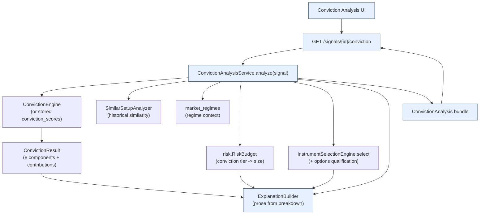
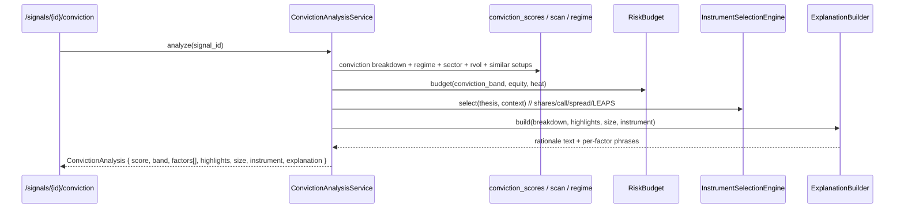

# Conviction Analysis — UI & Backend Architecture

Make every signal **self-explaining**: alongside each signal, show its conviction
score, the factors that produced it, the key market context, the recommended
position size and instrument — and a plain-English **rationale for the score**.

> **Status:** design (UI + backend architecture). No implementation yet.

## 1. It composes engines that already exist

Conviction Analysis is a **read / explanation layer**; almost everything it shows is
already computed by an existing engine:

| Display item | Source |
|---|---|
| **Conviction Score** (+ band) | `momentum.conviction` `ConvictionEngine` → `ConvictionResult.score/band`; persisted in `conviction_scores` |
| **Contributing Factors** | `ConvictionResult.components` — eight `ComponentScore(name, raw, normalized, weight, contribution)` that **sum to the score** |
| **Market Regime** | `market_regimes` (label / trend / volatility) — also conviction input `market_regime` |
| **Sector Strength** | `scan_results.sector_rs` — conviction input `sector_strength` |
| **Relative Volume** | `scan_results.relative_volume` — conviction input `relative_volume` |
| **Historical Similarity** | `conviction.SimilarSetupAnalyzer` (expectancy R, win rate, **sample size**) — input `historical_similar_setups` |
| **Recommended Position Size** | `risk.risk_budget` `RiskBudget` (conviction-tiered %) → risk sizing → shares / $ / % equity / stop |
| **Recommended Instrument** | `instruments.InstrumentSelectionEngine.select(thesis, context) -> InstrumentDecision` (shares / call / spread / LEAPS) + options qualification |
| **Explain why** | **new:** `ExplanationBuilder` — deterministic prose from the component contributions (no LLM) |

So the only genuinely new code is an **assembly service** + an **explanation
generator**. No new tables required (the conviction breakdown is already persisted).

## 2. The contributing factors

The conviction engine's eight components, each with a weighted **contribution** (points
of the 0-100 score). The four the spec calls out are highlighted (★):

| Factor | Reads | Default weight |
|---|---|---|
| ★ Market regime | bull / neutral / bear | 0.18 |
| Momentum score | scanner momentum | 0.18 |
| ★ Sector strength | sector RS percentile | 0.12 |
| Trend strength | ADX | 0.12 |
| ★ Relative volume | volume vs avg | 0.10 |
| Distance to ATH | gap below high | 0.10 |
| Breadth | % above 200DMA | 0.10 |
| ★ Historical similarity | expectancy of similar setups (shrunk by sample) | 0.10 |

Because contributions sum to the score, the breakdown **is** the explanation — the
generator just narrates it.

---

## 3. UI wireframes

### 3.1 Signals list — conviction badges

```
┌─ Signals ───────────────────────────────────── run: live-2024 · regime: BULL ▲ ─────┐
│  Symbol  Type   Dir  Px      Conviction         Top drivers           Size    Instr  │
│  NVDA    entry  L   $98.5   ███████████▉ 92 ◆E  momentum·regime·sector 1.0%   spread │
│  AAPL    entry  L   $185    █████████▏  78 ◆H  regime·momentum         0.75%  shares │
│  SMCI    entry  L   $640    ████████▏   71 ◆H  sector·rvol             0.75%  call   │
│  XOM     entry  L   $104    █████▏      44 ◦M  (mixed; weak momentum)  0.40%  shares │
│  KO      entry  L   $59     ███▏        31 ◦L  regime only             —      —      │
│                                            click a row ▸ Conviction Analysis (§3.2)   │
└──────────────────────────────────────────────────────────────────────────────────────┘
```

### 3.2 Per-signal Conviction Analysis panel

```
┌─ Conviction Analysis · NVDA · LONG entry · 2024-01-04 ───────────────────────────────┐
│ ┌─ Score ─────────────┐ ┌─ Contributing factors (points of 100) ───────────────────┐ │
│ │      ╭───────╮       │ │ Momentum        ██████████████████ +16.6  strong         │ │
│ │      │  92   │       │ │ Market regime   ████████████████   +16.2  bullish         │ │
│ │      │EXTREME│       │ │ Sector strength ██████████         +9.6   top-quartile    │ │
│ │      ╰───────╯       │ │ Trend (ADX)     ███████████        +10.8  trending        │ │
│ │  band cut-offs:      │ │ Rel. volume     ███████            +7.0   1.8× heavy       │ │
│ │  L<40 M<70 H<85 E    │ │ Historical sim. ████████           +9.0   +0.7R · n=24     │ │
│ │                      │ │ Breadth         ██████             +6.0   constructive     │ │
│ │  config #a91f…       │ │ Distance to ATH ██████             +6.8   near highs       │ │
│ └──────────────────────┘ │  ▲ drivers (green)            drag (amber) ▼              │ │
│                          └────────────────────────────────────────────────────────────┘ │
│ ┌─ Market context ────────────────────────────────────────────────────────────────────┐ │
│ │ ★Regime  BULL · uptrend · normal vol   ★Sector  Semis RS 0.86 (top 14%)             │ │
│ │ ★Rel.vol 1.8× (heavy participation)    ★History 24 similar · +0.71R · 58% win        │ │
│ └──────────────────────────────────────────────────────────────────────────────────────┘ │
│ ┌─ Recommended position size ─────────────┬─ Recommended instrument ──────────────────┐ │
│ │ Conviction tier  EXTREME → risk 1.0%    │ Type     Mar 15 95/115 call spread        │ │
│ │   (base 0.75% × 1.33 conviction lift)   │ Cost     $7.20 · max loss $720/contract   │ │
│ │ Stop   $92.00 (2.5·ATR)  risk $1,000    │ Expected move +9% / 30d · IV 41%          │ │
│ │ Shares 120 ($11,820 · 11.8% equity)     │ Qualification ✓ OI/spread/vol/IV/Γ pass   │ │
│ └─────────────────────────────────────────┴────────────────────────────────────────────┘ │
│ ┌─ Why this score ──────────────────────────────────────────────────────────────────────┐ │
│ │ Conviction 92 (EXTREME). Driven by strong momentum (+16.6) in a bullish regime        │ │
│ │ (+16.2), with top-quartile sector strength (+9.6) and a confirming 1.8× relative      │ │
│ │ volume. 24 historically similar setups returned +0.71R (58% win), reinforcing the     │ │
│ │ edge. Distance-to-ATH and breadth are supportive, not limiting. No factor materially   │ │
│ │ caps the score. → EXTREME tier lifts risk to 1.0%; expected move + IV favor a defined- │ │
│ │ risk call spread (all liquidity/greek gates pass).                                     │ │
│ └────────────────────────────────────────────────────────────────────────────────────────┘ │
└────────────────────────────────────────────────────────────────────────────────────────────┘
```

---

## 4. Backend architecture



`ConvictionAnalysisService.analyze(signal)` resolves the conviction breakdown (prefer
the persisted `conviction_scores` row for the signal; otherwise score on the fly from
the signal's features), enriches the four highlighted factors, asks the risk-budget
engine for the conviction-tiered size, asks the instrument engine for the recommended
structure, and hands the assembled bundle to the `ExplanationBuilder`.

### Assembly sequence



---

## 5. Explanation generator (the new piece)

Deterministic, auditable, **no LLM**. Rules over the conviction breakdown:

1. **Rank** components by `contribution` → top **drivers**; rank by *shortfall*
   (`weight·(1−normalized)`, the points *lost*) → top **detractors / caps**.
2. **Phrase** each factor from its normalized band via a per-factor template, e.g.
   momentum: `≥0.8 "strong" · 0.5–0.8 "moderate" · <0.4 "weak"`; regime: label words;
   relative volume: `×{rvol} ({"heavy"/"average"/"light"} participation)`; historical:
   `{n} similar setups returned {expectancy:+.2f}R ({win:.0%} win)`; small `n` →
   "limited history (n={n})".
3. **Compose** headline → drivers → detractors/caps → highlight summary → sizing
   rationale (tier lift) → instrument rationale (expected move + IV + qualification) →
   caveats (missing/neutral inputs, thin history, regime risk).

The output is a paragraph **and** a structured `factor → phrase` map (so the UI can show
both the prose and per-bar tooltips). Same inputs → same text (testable).

---

## 6. Data-source mapping

| Bundle field | Source |
|---|---|
| `score`, `band`, `factors[]`, `config_hash` | `conviction_scores` (or `ConvictionResult` computed from `signals.features`) |
| `highlights.regime` | `market_regimes` via `signals.regime_id` (label/trend/vol) |
| `highlights.sector_strength`, `relative_volume` | `scan_results` (or the conviction component raws) |
| `highlights.historical` | `SimilarSetupAnalyzer.analyze(regime, sector)` → expectancy / win / n |
| `size` | `RiskBudget(conviction_band)` × risk sizing → shares / notional / weight / stop / risk$ |
| `instrument` | `InstrumentDecision` (type, strikes, cost, max-loss, qualification) |
| `explanation` | `ExplanationBuilder` |

No new persistence for v1: `conviction_scores` is the source of truth; the analysis is
assembled on demand (cheap). The rendered explanation may be cached on the
`conviction_scores` row later if desired.

---

## 7. API contract (extends `momentum.api`)

| Endpoint | Returns |
|---|---|
| `GET /signals/{id}/conviction` | full **ConvictionAnalysis** bundle (score, band, factors[], highlights, size, instrument, explanation) |
| `GET /signals?include=conviction` | signals list enriched with score/band/top-drivers (badges) |
| `GET /signals/{id}/conviction/explain` | just the rationale text + per-factor phrase map |

`ConvictionAnalysisOut` (Pydantic) mirrors the bundle; reuses the existing `get_session`
dependency and the conviction/risk/instrument engines.

---

## 8. Implementation notes

New package `src/momentum/conviction/analysis.py` (or `momentum.analysis_conviction`):
`ConvictionAnalysis` dataclass + `ConvictionAnalysisService` + `ExplanationBuilder`
(pure). Plus `api/routes/conviction.py` and `ConvictionAnalysisOut` schema.

| Phase | Deliverable | Exit |
|---|---|---|
| 1 | `ExplanationBuilder` (pure: breakdown → prose + phrase map) | seeded-free, deterministic; tests per factor/band |
| 2 | `ConvictionAnalysisService.analyze` composing conviction + regime + similarity + risk budget + instrument | bundle assembles for a seeded signal |
| 3 | `GET /signals/{id}/conviction` + schema | endpoint returns the bundle (in-memory-DB test) |
| 4 | UI: signal badges + analysis panel (Plotly factor bars) | the panel renders all eight required items |

Follows the repo's `add-subsystem` conventions; the pure `ExplanationBuilder` is the
highest-value, most-tested unit.

---

## 9. Self-critique / caveats

- **Explanation faithfulness.** The prose is generated *from* the actual contributions
  (not a post-hoc story), so it can't disagree with the score — but template phrasing
  must track the config's normalization bands, or wording could drift from the numbers;
  the phrase thresholds are therefore derived from `ConvictionNormalization`, not
  hardcoded.
- **Thin history.** Historical similarity shrinks toward neutral for small samples; the
  explanation must say "limited history (n=…)" rather than imply a strong edge.
- **Instrument recommendation is conditional** on an options chain being available and
  passing qualification; when it isn't, the panel recommends shares and says why.
- **On-demand cost.** Assembly runs the instrument selector and a similarity query per
  view; fine interactively, but a batch/list view should reuse stored conviction rows
  and lazy-load the instrument/explanation to stay snappy.
- **Read-only.** Conviction Analysis explains and recommends; it never sizes or places a
  trade — the risk gateway remains the single chokepoint for actual orders.
