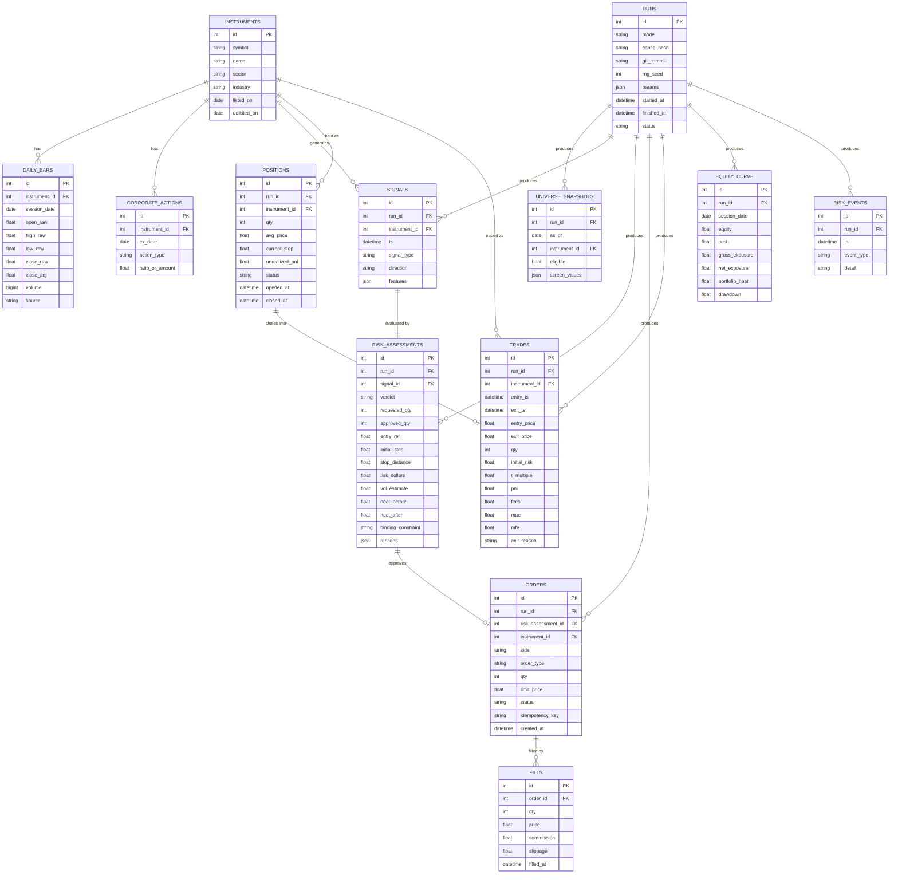

# Data Model — Persistence & Audit Schema

SQLite (WAL mode) via SQLAlchemy 2.0 for research; the repository pattern keeps the schema swappable to Postgres for production. Every model lives in `src/momentum/persistence/models/`.

> **Status:** Schema specification only — no ORM code implemented yet.

The schema is designed around one requirement: **full auditability and reproducibility.** Raw inputs, every decision, and every outcome are all persisted and linked back to the `run` that produced them.

---

## 1. Entity-relationship diagram

---

## 2. Table responsibilities

### Reference / input data
| Table | Role |
|---|---|
| **instruments** | Security master: symbol, name, sector/industry, listing & delisting dates (delisting dates are what make backtests survivorship-bias-free). |
| **daily_bars** | OHLCV per `(instrument, session_date)`. Stores **both** raw and adjusted closes so adjustments are transparent and reproducible. `source` records provenance. |
| **corporate_actions** | Splits/dividends used to derive `close_adj`. Keeping them means adjustments can be recomputed and audited. |

### Decision trail (the audit core)
| Table | Role |
|---|---|
| **universe_snapshots** | Point-in-time record of which names were eligible and the exact screen values — *"what could we have traded that day?"* |
| **signals** | Every signal with the full `features` vector that produced it — *"what did the strategy see?"* |
| **risk_assessments** | One row per proposed trade: verdict, sizing math, the binding constraint, and reasons — *"why this size / why rejected?"* The spine of risk auditability. |
| **risk_events** | Limit breaches, circuit-breaker trips, drawdown-throttle changes — *"when did protection engage?"* |

### Execution & outcome
| Table | Role |
|---|---|
| **orders** | Submitted orders with `idempotency_key` (prevents duplicate sends) and lifecycle `status`. Linked to the `risk_assessment` that authorized them — no order without an approval. |
| **fills** | Executions per order, including modeled `slippage` and `commission`, so realized vs intended price is always inspectable. |
| **positions** | Open/closed position snapshots with live `current_stop` and P&L. |
| **trades** | Closed round-trips with `r_multiple`, `pnl`, `fees`, `mae`/`mfe` and `exit_reason` — the atomic unit for all of `analytics/`. |
| **equity_curve** | Daily account snapshot: equity, cash, exposure, **portfolio_heat**, drawdown — drives performance + the drawdown throttle. |

### Reproducibility
| Table | Role |
|---|---|
| **runs** | The registry every other row points to. Captures `mode`, `config_hash`, `git_commit`, `rng_seed` and `params`. Given a `run_id`, a result is regenerable bit-for-bit, and any two runs are directly comparable. |

---

## 3. Auditability guarantees

1. **No order without a recorded approval.** `orders.risk_assessment_id` is mandatory; the risk verdict that authorized any trade is always retrievable.
2. **Full lineage.** `signal → risk_assessment → order → fill → position → trade`, all tagged with `run_id`. Any trade can be traced back to the exact features and risk math behind it.
3. **Append-only audit log.** `persistence/audit.py` writes an immutable event stream in parallel to the relational tables; rows are never updated in place for decision records.
4. **Reproducible inputs.** Raw bars + corporate actions are stored, so the adjusted series a decision used can always be rebuilt.
5. **Reproducible runs.** `config_hash` + `git_commit` + `rng_seed` pin code, parameters and randomness.

---

## 4. Indexing & integrity notes (for implementation)

- Unique constraint on `daily_bars(instrument_id, session_date)`; index on `session_date` for range scans.
- Unique constraint on `orders(idempotency_key)`.
- Index foreign keys used by analytics: `trades(run_id)`, `equity_curve(run_id, session_date)`, `risk_assessments(run_id, signal_id)`.
- `runs.config_hash` indexed for fast experiment comparison.
- SQLite pragmas: `journal_mode=WAL`, `foreign_keys=ON`, `synchronous=NORMAL` for research throughput.
