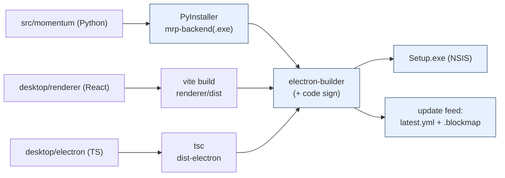
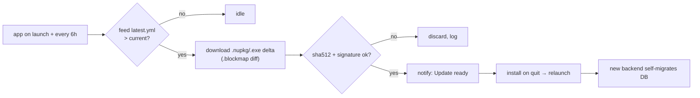
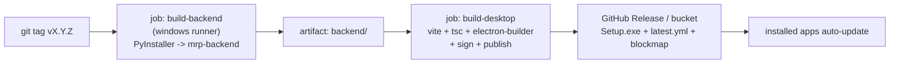

# Deployment Architecture — Single-Click Desktop Install

How the platform ships as a **single-click Windows desktop app**: build → package →
migrate → auto-update → release. This is the *release & packaging* architecture; the
*runtime* topology (Electron shell + FastAPI sidecar + SQLite) lives in
**[DESKTOP_APP.md](DESKTOP_APP.md)** and the UX in **[DESKTOP_UX.md](DESKTOP_UX.md)** —
this doc cross-references them and fills the deployment gaps (auto-update,
migrate-on-launch, installer/signing, production CI).

> **Status:** design. The `desktop/` scaffold (Electron + React renderer +
> `electron-builder.yml`, sidecar `mrp-backend`) exists; this specifies how it is
> packaged, migrated, signed, shipped and updated.

## 1. The shippable unit

```
Momentum Research Platform.exe  (NSIS one-click installer)
└─ Electron app
   ├─ renderer (React/Vite build)            — the UI
   ├─ electron/main (lifecycle + updater)    — spawns & supervises the backend
   └─ resources/backend/mrp-backend.exe      — PyInstaller-frozen FastAPI + migrations
SQLite DB → %APPDATA%/Momentum Research Platform/momentum.db   (writable user data)
```

The backend is **bundled inside** the Electron app, so updating the app updates the
backend, the migrations and the UI together — one artifact, one version.

---

## 2. Startup sequence (with the migration gap closed)

The current `main.ts` spawns the sidecar and waits for `/health`. Deployment adds two
things: a **writable user-data DB path** and **migrate-on-launch**.

```mermaid
sequenceDiagram
    participant M as electron/main
    participant U as Updater
    participant B as mrp-backend (sidecar)
    participant DB as %APPDATA%/…/momentum.db

    M->>M: single-instance lock; pick free loopback port
    M->>U: checkForUpdates() (non-blocking)
    M->>B: spawn(env: DATABASE_URL=sqlite:///<userData>/momentum.db)
    B->>DB: backup copy (momentum.db.bak)
    B->>DB: alembic upgrade head  (bundled migrations)
    B->>B: uvicorn create_app() on 127.0.0.1:<port>
    M->>B: poll /health → ready
    M->>M: load renderer → window shown
    Note over U: if update ready → notify → install on quit
```

The DB lives in **userData** (writable), never in the read-only install dir. The
backend **self-migrates on startup** so the bundled `alembic` migrations always travel
with the binary that needs them.

---

## 3. Build pipeline



---

## 4. FastAPI packaging (PyInstaller)

Freeze the existing `momentum` package + uvicorn into one binary (`mrp-backend`), as
referenced by `electron-builder.yml` (`extraResources: build/backend → backend`). The
key subtlety: **bundle the Alembic migrations, `alembic.ini` and configs as data**, and
declare uvicorn/SQLAlchemy hidden imports.

`desktop/backend/serve.py` (frozen entry point):
```python
# Resolve writable DB (from Electron) and self-migrate before serving.
import os, sys, shutil, pathlib
from alembic import command
from alembic.config import Config

def _resource(rel):                      # works frozen (sys._MEIPASS) and from source
    base = getattr(sys, "_MEIPASS", os.getcwd())
    return os.path.join(base, rel)

def migrate(db_url: str) -> None:
    db = pathlib.Path(db_url.replace("sqlite:///", ""))
    if db.exists():
        shutil.copy2(db, db.with_suffix(".db.bak"))   # backup before upgrade
    cfg = Config(_resource("alembic.ini"))
    cfg.set_main_option("script_location", _resource("momentum/persistence/migrations"))
    cfg.set_main_option("sqlalchemy.url", db_url)
    command.upgrade(cfg, "head")

if __name__ == "__main__":
    url = os.environ["DATABASE_URL"]
    migrate(url)
    import uvicorn
    uvicorn.run("momentum.api.app:create_app", factory=True,
                host="127.0.0.1", port=int(os.environ["MRP_PORT"]))
```

`mrp-backend.spec` essentials:
```python
datas = [
    ("../src/momentum/persistence/migrations", "momentum/persistence/migrations"),
    ("../alembic.ini", "."),
    ("../config", "config"),
]
hiddenimports = ["uvicorn.logging", "uvicorn.loops.auto", "uvicorn.protocols.http.auto",
                 "aiosqlite", "sqlalchemy.dialects.sqlite"]
# onedir (recommended): faster cold start than onefile (no per-launch extraction)
```

> **onedir over onefile.** `--onefile` re-extracts to a temp dir every launch (slow,
> AV-scanned each time). `--onedir` under `extraResources/backend/` starts faster and is
> friendlier to SmartScreen. Trade-off: a folder of files vs. one binary.

---

## 5. SQLite migration system (the gap)

- **One Alembic chain** already exists (`0001…0007`); it ships inside `mrp-backend` and
  runs as `alembic upgrade head` against the **userData** DB on every launch.
- **First run:** no DB → `upgrade head` builds the full schema and stamps the version.
- **Update run:** existing DB at an older head → the new bundle's extra revisions apply
  forward-only. **Backup first** (`momentum.db.bak`); on failure, the app surfaces a
  "database upgrade failed — restored backup" dialog and stays on the prior version.
- **Forward-only.** Auto-update never downgrades the schema; a user rolling back an app
  version is blocked if the DB is ahead (clear message), matching Alembic's linear
  history.
- **Integrity:** `PRAGMA foreign_keys=ON` + WAL (already configured); a `PRAGMA
  quick_check` runs post-migrate and is logged. (Deeper backup/integrity automation is
  the System Logging architecture's remit.)

---

## 6. Auto-update architecture

`electron-updater` (NSIS differential updates) against a **release feed**.



- **Feed:** GitHub Releases (`publish: github`) or a static bucket (`publish: generic`,
  e.g. S3/CloudFront). electron-builder emits `latest.yml` + `*.blockmap` for deltas.
- **Channels:** `latest` (stable) and `beta`; `autoUpdater.channel` is user-selectable
  in Settings. Staged rollout via separate channel feeds.
- **Trust:** the installer is Authenticode-signed; electron-updater verifies the
  publisher signature + sha512 before applying.
- **Update ↔ migration:** download is silent; on the next launch the **new** bundled
  backend runs the **new** migrations (backup first, §5). No mid-session schema changes.

`main.ts` additions:
```ts
import { autoUpdater } from "electron-updater";
autoUpdater.autoDownload = true;
autoUpdater.on("update-downloaded", () => notifyUserUpdateReady());
app.whenReady().then(() => autoUpdater.checkForUpdatesAndNotify());
setInterval(() => autoUpdater.checkForUpdates(), 6 * 60 * 60 * 1000);
// app.requestSingleInstanceLock() guards against two backends on one DB
```

---

## 7. Installer generation (NSIS) & Windows packaging

`electron-builder.yml` (extends the existing file):
```yaml
win:
  target: [nsis]          # + portable for a no-install zip
  signtoolOptions:        # Authenticode (or azureSignOptions for Trusted Signing)
    certificateSubjectName: "Momentum Research Platform"
  signAndEditExecutable: true     # also signs the bundled mrp-backend(.exe)
nsis:
  oneClick: false                 # assisted installer, but still "next-next-finish"
  perMachine: false               # per-user → no admin prompt (smoother single-click)
  allowToChangeInstallationDirectory: true
  createDesktopShortcut: true
  createStartMenuShortcut: true
  shortcutName: Momentum Research Platform
  artifactName: ${productName}-${version}-Setup.${ext}
publish:
  provider: github                # or: { provider: generic, url: https://updates.…/win }
```

**Windows specifics**
- **Code signing** is essential — unsigned apps trip SmartScreen and AV flags the
  PyInstaller binary. EV/OV Authenticode cert (or **Azure Trusted Signing**) signs both
  the Electron app and the sidecar exe; EV builds SmartScreen reputation fastest.
- **Outputs** (`release/`): `…-Setup.exe` (the single-click installer), `latest.yml`,
  `…-Setup.exe.blockmap` (delta source), plus an optional `portable.exe`.
- **Per-user install** avoids the UAC prompt, keeping the "single-click" promise; offer
  a per-machine MSI variant for managed/enterprise deployments later.

---

## 8. Development workflow

The scaffold's scripts already exist; the full loop:

| Step | Command |
|---|---|
| Backend (hot reload) | `make serve` (uvicorn `--reload`) — or `python -m momentum.api` |
| DB migrations (dev) | `make migrate` / `make migration m="…"` (against `data/momentum.db`) |
| Desktop (renderer + electron) | `cd desktop && npm run dev` (vite + electron, dev backend = `python -m momentum.api`) |
| Quality gate | `make check` (Python) · `npm run typecheck` (renderer + electron) |

`main.ts.backendCommand()` already branches: **dev** → `python -m momentum.api`
(system venv), **packaged** → `resources/backend/mrp-backend`. The renderer also runs in
a plain browser tab against `make serve`, so UI work needs no Electron.

---

## 9. Production workflow (CI → signed installer → auto-update)

PyInstaller must build on the **target OS**, so the release is a matrix.



GitHub Actions sketch:
```yaml
jobs:
  backend:
    runs-on: windows-latest
    steps: [checkout, "pip install -e . pyinstaller",
            "pyinstaller desktop/backend/mrp-backend.spec",
            "upload-artifact build/backend"]
  desktop:
    needs: backend
    runs-on: windows-latest
    steps: [checkout, "download-artifact -> desktop/build/backend",
            "npm ci && npm run build",
            "electron-builder --win --publish always"]   # secrets: CSC_LINK, CSC_KEY_PASSWORD, GH_TOKEN
```

- **Versioning:** single source = root `package.json` / `version` (one tick per release,
  per the repo's push policy); the backend reports it at `/health` for diagnostics.
- **Release = publish to the feed.** Once `latest.yml` is live, every installed app
  upgrades itself (§6). Pre-releases go to the `beta` channel.
- **Smoke gate:** CI launches the packaged app headless, asserts `/health` 200 and a
  successful `alembic upgrade head` on a fresh profile before the release is promoted.

---

## 10. Self-critique / risks

- **AV / SmartScreen false positives** on a freshly-signed PyInstaller binary are the
  top desktop-distribution pain. Mitigations: code-sign **both** exes, prefer `onedir`,
  use an EV cert to seed reputation, and submit the installer to Microsoft for analysis.
- **Cold-start latency:** `onefile` extraction can add seconds on first launch and on
  every AV rescan — `onedir` is recommended; show a splash until `/health` is ready.
- **Migration safety:** forward-only with a pre-upgrade backup; a failed upgrade restores
  the backup and pins the prior app version. No automatic downgrade path.
- **Port conflicts / multiple instances:** pick a free loopback port at launch and take a
  single-instance lock so two windows never share one SQLite file.
- **Signing-cert custody:** certs live only in CI secrets (`CSC_LINK`/`CSC_KEY_PASSWORD`)
  or Azure Trusted Signing — never in the repo.
- **Cross-platform:** `electron-builder.yml` already lists dmg/AppImage; the same pipeline
  produces mac/Linux artifacts, but Windows single-click is the focus here and the only
  one with the signing/SmartScreen nuances above.
