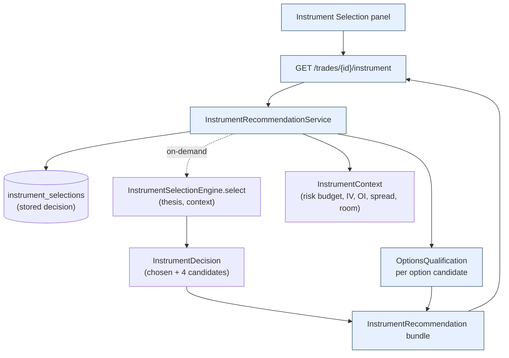

# Instrument Selection — UI & Display Architecture

Show, **for every trade**, the recommended way to express it — **shares, long call,
call spread, or LEAPS** — side-by-side with each candidate's **liquidity, open
interest, IV, DTE and risk characteristics**, and store the recommendation.

> **Status:** design (UI + display architecture). The selection *engine* and storage
> already exist; this document specifies the **display layer** on top of them.

## 1. What already exists (reused, not rebuilt)

The recommendation backend is implemented — see `docs/INSTRUMENT_SELECTION.md` and
`docs/OPTIONS_QUALIFICATION.md`:

| Spec item | Already provided by |
|---|---|
| Recommend **Shares / Calls / Call Spreads / LEAPS** | `instruments.InstrumentSelectionEngine.select(thesis, context) -> InstrumentDecision` — scores **all four** as `CandidateScore`s and picks one |
| **Open Interest**, **IV**, **Liquidity** (spread) inputs | `InstrumentContext.options_open_interest`, `implied_vol_annual`, `options_spread_pct`, `share_dollar_volume` |
| **DTE**, strikes, delta, **risk characteristics** | `InstrumentStructure.expiry_days`, `long/short_strike`, `target_delta`, `est_cost`, `max_loss`, `max_profit` |
| OI / spread / volume / **DTE** / IV / gamma **gates** | `instruments.qualification` `OptionsQualification` (per-contract qualify/reject + reasons) |
| **Store recommendations** | `instrument_selections` table (migration `0005`) — instrument, confidence, margin, iv_rv_ratio, expiry_days, strikes, delta, contracts/shares, est_cost, max_loss, max_profit, rationale, **candidates JSON** |

So this design adds only the **presentation layer**: a per-trade panel + a thin
read-API that assembles the decision and per-candidate qualification for display.

## 2. The decision shape (what we render)

`InstrumentDecision` already carries everything the panel needs:

- `instrument` (chosen) · `structure` (the concrete contract) · `confidence` (top score)
  · `margin` (gap to runner-up = decisiveness) · `iv_rv_ratio` (option richness) ·
  `rationale` (why) · `candidates: tuple[CandidateScore, ...]` (all four scored, with
  `eligible`, `components`, `reasons`).

Per-candidate **liquidity / OI / IV / DTE / gamma** for the display come from running
the candidate's contract through `OptionsQualification` (or from the stored snapshot —
see §6).

---

## 3. UI wireframes

### 3.1 Trades / signals list — instrument badge

```
┌─ Trades ───────────────────────────────────────────────── run: live-2024 ──────────┐
│  Symbol  Conv   Instrument              Cost     Defined risk  DTE   Liquidity       │
│  NVDA    92 ◆E  95/115 call spread       $720     $720          70d   ✓              │
│  AAPL    78 ◆H  shares × 120             $22,200  stop-based    —     ✓              │
│  SMCI    71 ◆H  ATM call × 3             $4,100   $4,100        45d   ✓              │
│  XOM     44 ◦M  shares × 90              $9,360   stop-based    —     ✓              │
│                                              click a row ▸ Instrument Selection (§3.2)│
└──────────────────────────────────────────────────────────────────────────────────────┘
```

### 3.2 Per-trade Instrument Selection panel (four candidates side-by-side)

```
┌─ Instrument Selection · NVDA · LONG · entry $98.50 · exp move +20% / 40d · conv 92 ──┐
│  Risk budget (1R) $1,000   ·   IV 41%  (IV/RV 1.30 — rich)   ·   capital room 80%     │
│ ┌ Shares ─────────┐ ┌ Long call ──────┐ ┌ Call spread ★ ──┐ ┌ LEAPS ──────────┐     │
│ │ score   0.62    │ │ score   0.71    │ │ score   0.86 ✓  │ │ score   0.55    │     │
│ │ 120 sh          │ │ ATM Δ.55 ×3     │ │ 95/115 Δ.40 ×5  │ │ Jan'26 Δ.70 ×2  │     │
│ │ ───────────────│ │ ───────────────│ │ ───────────────│ │ ───────────────│     │
│ │ Cost   $11,820  │ │ Cost   $4,100   │ │ Debit  $720     │ │ Cost   $2,600   │     │
│ │ Max loss stop   │ │ Max loss $4,100 │ │ Max loss $720   │ │ Max loss $2,600 │     │
│ │ Max gain  open  │ │ Max gain  open  │ │ Max gain $1,280 │ │ Max gain  open  │     │
│ │ Delta   1.00    │ │ Delta   0.55    │ │ Delta   0.40    │ │ Delta   0.70    │     │
│ │ DTE     —       │ │ DTE     45      │ │ DTE     70      │ │ DTE     380     │     │
│ │ Open int —      │ │ OI    4,200 ✓   │ │ OI    3,100 ✓   │ │ OI      900 ⚠   │     │
│ │ Liquidity ✓ und │ │ Spread  3% ✓    │ │ Spread  4% ✓    │ │ Spread  9% ✗    │     │
│ │ IV      — / —   │ │ IV   41% ✓      │ │ IV   41% ✓      │ │ IV   41% ✓      │     │
│ │ Qualifies  n/a  │ │ Qualifies  ✓    │ │ Qualifies  ✓    │ │ Qualifies  ✗    │     │
│ └─────────────────┘ └─────────────────┘ └─────────────────┘ └─────────────────┘     │
│  ✓ RECOMMENDED: 95/115 call spread   confidence 0.86 · margin +0.15 vs long call     │
│  Why: a +20% / 40d thesis with IV/RV 1.30 (rich premium) favors a defined-risk debit │
│  spread — same directional exposure, cost capped at $720 (0.7R). LEAPS rejected:      │
│  bid/ask spread 9% > 8% gate.                          [ store ]  [ override ▾ ]      │
└────────────────────────────────────────────────────────────────────────────────────────┘
```

Every required display field appears **per candidate**: Liquidity (option spread / under-
lying $vol), Open Interest, IV, DTE, and Risk Characteristics (max loss / max gain /
cost / delta). The chosen structure is highlighted with confidence, decisiveness and the
rationale; failing gates show the reason inline.

---

## 4. Display architecture



`InstrumentRecommendationService.for_trade(trade_or_signal)`:
1. Resolve the **decision** — prefer the persisted `instrument_selections` row for the
   signal; otherwise compute on demand via `InstrumentSelectionEngine.select(...)` from
   the trade's thesis (expected move, horizon, conviction) and context.
2. For each option candidate, attach a **qualification snapshot** (`OptionsQualification`):
   OI, spread%, volume, DTE, IV, gamma + pass/fail + reasons.
3. Emit the bundle (chosen + four candidates, each with structure · liquidity · OI · IV ·
   DTE · risk characteristics · qualification).

---

## 5. Data-source mapping

| Display field | Source | Stored? |
|---|---|---|
| Instrument type, strikes, delta, contracts/shares | `InstrumentStructure` / `instrument_selections` | ✅ |
| Cost, **max loss**, **max gain** (risk characteristics) | `InstrumentStructure.est_cost/max_loss/max_profit` | ✅ |
| **DTE** | `InstrumentStructure.expiry_days` | ✅ |
| Confidence, margin, rationale, candidate scores | `InstrumentDecision` / `candidates` JSON | ✅ |
| **IV**, IV/RV | `InstrumentContext.implied_vol_annual`, `iv_rv_ratio` | iv_rv ✅ · raw IV ✱ |
| **Open Interest** | `InstrumentContext.options_open_interest` / `OptionsQualification.open_interest` | ✱ |
| **Liquidity** (option spread, underlying $vol) | `options_spread_pct` / `share_dollar_volume` / `OptionsQualification.spread_pct` | ✱ |
| Qualification pass/fail + reasons | `OptionsQualification` | ✱ |

✱ = currently a decision **input** (context) or recomputed, not a stored column — see §6.

---

## 6. Optional backend addition (the only gap)

For v1 the panel composes OI / spread / IV / qualification at **display time** from the
context/quote — no schema change. For a fully **auditable** record of *what was shown*,
add a small snapshot to `instrument_selections` (one `add-migration`):

```
+ implied_vol        float   # raw ATM IV at selection
+ open_interest      float   # ATM/near OI
+ option_spread_pct  float   # bid/ask as fraction of mid (liquidity)
+ qualification      JSON    # per-candidate OptionsQualification snapshot
```

This makes the liquidity/OI/IV display reproducible from storage alone (consistent with
the platform's auditability stance) without re-querying a chain.

---

## 7. API contract (extends `momentum.api`)

| Endpoint | Returns |
|---|---|
| `GET /trades/{id}/instrument` | full recommendation bundle (chosen + 4 candidates with structure · liquidity · OI · IV · DTE · risk · qualification · rationale) |
| `GET /signals/{id}/instrument` | same, keyed by signal (pre-trade) |
| `GET /instrument-selections` | stored recommendations (filter by run/symbol/instrument) — already-persisted rows |

`InstrumentRecommendationOut` (Pydantic) mirrors the bundle; reuses `get_session` and the
existing engines.

---

## 8. Implementation notes (light — backend mostly exists)

| Phase | Deliverable | Exit |
|---|---|---|
| 1 | `InstrumentRecommendationService.for_trade/for_signal` (compose decision + per-candidate qualification) | bundle assembles for a seeded signal |
| 2 | `GET /trades|signals/{id}/instrument` + `InstrumentRecommendationOut` | endpoint returns the bundle (in-memory-DB test) |
| 3 | UI: list badge + four-candidate panel (Plotly/HTML) | all required fields render per candidate |
| 4 (opt) | snapshot columns + migration (§6) | liquidity/OI/IV reproducible from storage; `alembic check` clean |

---

## 9. Self-critique / caveats

- **Not a rebuild.** The recommendation engine, the four structures, qualification and
  storage already exist; this is a display + thin compose-service. Duplicating the engine
  would have been wrong.
- **Display vs. stored.** Liquidity / OI / raw IV are decision inputs, not stored columns
  today — v1 recomputes them at display; §6 makes them auditable from storage if desired.
- **Chain availability.** Option fields require a live/cached options chain; with none,
  the panel shows shares only and labels options "no chain".
- **Recommendation ≠ order.** This recommends and stores; the risk gateway remains the
  single chokepoint for actual sizing/placement, and an explicit **override** is logged.
