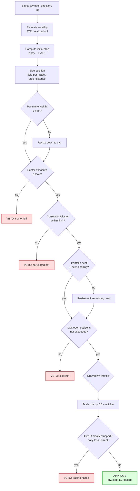

# Risk Management — Design Specification

This is the heart of the platform. The strategy is intentionally simple; **the risk engine is where the engineering effort and the edge live.**

> **Status: implemented.** Code in `src/momentum/risk/` (gateway:
> `risk_manager.py`); configuration in `risk_config.py` loaded from
> `config/risk.example.yaml`; tests in `tests/unit/risk/`. See §10 for the API.

---

## 1. Operating philosophy

1. **Think in `R`, not dollars.** `R` = the dollar amount risked on a trade (entry price − initial stop, × shares). Every outcome is measured in multiples of `R`. A winner is "+3R"; the worst expected case is "−1R".
2. **The stop defines the trade, then size follows.** We first decide *where we are wrong* (the stop), then size the position so that being wrong costs a fixed, small fraction of equity. Sizing **never** moves the stop.
3. **Cut losers at −1R, let winners run.** This is engineered for **positive skew**: a lower win rate is acceptable in exchange for occasional large trend captures. The trailing-stop policy is what turns a breakout into a multi-week, multi-R move.
4. **Risk is controlled at three levels:** per-trade, per-cluster (correlation/sector), and portfolio-wide (heat, exposure, drawdown, circuit breakers). A trade can be individually sound and still be rejected because the *portfolio* cannot afford it.
5. **Every decision is auditable.** The engine emits a `RiskAssessment` for *every* proposed trade — including rejections and the exact reason — and persists it.

This directly serves the stated goal — *"larger plays with larger wins and potential for larger losses at a less frequent rate"*: per-trade downside is bounded near −1R, win rate is allowed to be < 50%, and the right tail is left open by trailing stops.

---

## 2. The risk gateway

`risk_manager.RiskManager.evaluate()` is the single chokepoint. A `Signal` enters; a `RiskAssessment` leaves. No order is created anywhere in the system without one.



The order of checks is deliberate: **cheap, local checks first; portfolio-wide checks last; the kill-switch is final.** Any RESIZE/VETO records the binding constraint by name.

---

## 3. Volatility — the unit of risk

Everything scales off a volatility estimate, so positions in calm and wild names carry comparable risk.

| Estimator | Use |
|---|---|
| **ATR(n)** (Wilder) | Stop placement and per-trade risk-per-share. Default `n = 20`. |
| **Close-to-close / EWMA σ** | Volatility targeting and exposure scaling. |
| **Parkinson / Yang–Zhang** | Range-based σ for noisy names (optional, more efficient). |

`module: risk/volatility.py`

---

## 4. Position sizing

`module: risk/position_sizing.py`. Three interchangeable methods (selected in `config/risk.yaml`). All produce an integer share count and **never widen the stop**.

### 4.1 Fixed-fractional risk *(default)*
```
risk_dollars   = equity × risk_per_trade_pct          # e.g. 100,000 × 0.75% = 750
stop_distance  = entry_price − initial_stop           # = k × ATR
shares         = floor( risk_dollars / stop_distance )
```
Being stopped costs exactly `risk_per_trade_pct` of equity (≈ −1R), regardless of the stock's price or volatility. This is the primary lever.

### 4.2 Volatility targeting
Size so each position contributes a target annualized volatility:
```
shares ≈ (target_vol_annual × equity) / (σ_annual_stock × price)
```
Used when the goal is a stable portfolio volatility rather than a fixed per-trade loss.

### 4.3 Fractional Kelly (capped)
```
f* = edge / odds              # estimated from the trade-stats history
size_fraction = clamp( kelly_fraction × f*, 0, max_position_weight )
```
Only ever a *fraction* of full Kelly (default ¼) and hard-capped — full Kelly is too aggressive for real drawdowns.

> Whatever the method, the result is then clamped by **`max_position_weight`** (notional cap) and the **heat** budget (§6.3).

---

## 5. Stops — the exit policy that creates skew

`module: risk/stops.py`. Stops define `R` and are what let winners run.

| Stop | Rule | Purpose |
|---|---|---|
| **Initial** | `entry − k·ATR` (default `k = 2.5`) | Defines −1R. Wide enough to survive noise, tight enough to bound loss. |
| **Breakeven** | move stop to entry once trade reaches **+1R** | Converts a winner into a free option. |
| **Chandelier (trailing)** | `highest_high_since_entry − m·ATR` (default `m = 3.0`), monotonically rising | Captures large trend moves; the engine of positive skew. |
| **Time stop** | exit if not progressing after `max_holding_days` | Frees capital from dead trades. |
| **Channel exit** | exit on N-day-low (Donchian) break | Strategy-level trend-following exit (in `signals/`). |

The trailing stop only ever ratchets **up** (for longs). The asymmetry — fixed downside (−1R), open-ended upside (trail) — is the entire point.

> **Gap risk is explicit.** A stop is not a guarantee; overnight gaps can exit beyond the stop (a loss worse than −1R). This is the "potential for larger losses" the strategy accepts. Per-name weight caps and portfolio heat limits exist precisely to bound how bad a single gap can be.

---

## 6. Portfolio-level controls

A trade can be individually fine yet still be resized or rejected because of portfolio state.

### 6.1 Exposure limits — `risk/exposure.py`
- `max_gross_exposure`, `max_net_exposure` (default `1.0` → no leverage).
- `max_sector_weight` (default 35%) — prevents a sector bet masquerading as diversification.

### 6.2 Correlation / clustering — `risk/correlation.py`
Rolling correlation of candidate vs open positions. Reject (or down-weight) a new entry whose correlation exceeds `max_pairwise_correlation` (default 0.70), and cap positions per correlated cluster. **Ten correlated breakouts are one bet, not ten.**

### 6.3 Portfolio heat — `risk/heat.py`
"Heat" = sum of open risk across all positions (each position's current distance-to-stop × shares).
```
portfolio_heat = Σ (current_stop_distanceᵢ × sharesᵢ) / equity
constraint:    portfolio_heat ≤ max_portfolio_heat   # default 6%
```
If a new trade would breach the ceiling, it is **resized down** to fit the remaining budget, or vetoed if no room remains. This bounds total simultaneous risk — the worst case if *everything* stops out at once.

### 6.4 Drawdown throttle — `risk/drawdown.py`
As the equity curve draws down, automatically scale `risk_per_trade`:

| Drawdown | Risk multiplier |
|---|---|
| 0–10% | 1.00 |
| 10–15% | 0.75 |
| 15–20% | 0.50 |
| > 20% | 0.25 |

This de-risks into bad regimes and re-risks on recovery — protecting capital when the strategy is out of sync with the market, without a discretionary override.

### 6.5 Circuit breakers — `risk/limits.py`
Hard kill-switches, evaluated last:
- `daily_loss_kill_switch_pct` (default 4%) — halt **new** entries for the day (open trades keep their stops).
- `max_consecutive_losses` (default 8) — pause new entries and flag for human review.
- `max_open_positions` (default 12) — slot limit.

---

## 7. The `RiskAssessment` (audit record)

Every call to `evaluate()` produces one record, persisted to the `risk_assessments` table:

| Field | Meaning |
|---|---|
| `verdict` | `APPROVE` \| `RESIZE` \| `VETO` |
| `symbol`, `signal_id`, `run_id`, `ts` | Linkage and lineage |
| `requested_qty`, `approved_qty` | Sizing before/after constraints |
| `entry_ref`, `initial_stop`, `stop_distance`, `risk_dollars`, `r_per_share` | The trade's risk math |
| `binding_constraint` | Which rule resized/vetoed (e.g. `portfolio_heat`, `correlation`) |
| `vol_estimate`, `equity`, `portfolio_heat_before/after` | Context at decision time |
| `reasons[]` | Human-readable explanation |

This is what makes the system *fully auditable*: for any moment in history you can reconstruct exactly why a trade happened (or didn't), at what size, with what stop, and which constraint was binding.

---

## 8. Worked example

```
Account equity ............ $100,000
risk_per_trade_pct ........ 0.75%        → risk_dollars = $750  (= 1R)
Signal .................... AAPL long breakout
Entry (next-open ref) ..... $50.00
ATR(20) ................... $1.50
Initial stop = 50 − 2.5×1.50 = $46.25    → stop_distance = $3.75/share
Shares = floor(750 / 3.75) = 200
Notional = 200 × $50 = $10,000 = 10% of equity   (< 20% cap ✓)
Open risk added = 200 × $3.75 = $750 = 0.75% heat (portfolio heat now must stay ≤ 6% ✓)
```
Outcomes, in `R`:
- Stopped at $46.25 → **−$750 = −1R**.
- Breakout runs to $65, trail exits at $61 → +$2,200 = **+2.9R**.

### Why positive skew wins
With a let-winners-run exit, a *sub-50%* win rate is still strongly profitable:

| Win rate | Avg win | Avg loss | Expectancy / trade |
|---|---|---|---|
| 40% | +3.0R | −1.0R | **+0.60R** |
| 35% | +4.0R | −1.0R | **+0.75R** |
| 51% | +1.01R | −1.0R | **+0.025R** (the soft-edge floor) |

The architecture supports the soft 1.01/1 floor, but is *designed* for the fat-right-tail profile: infrequent large winners, many small controlled losses.

---

## 9. Parameters (all in `config/risk.yaml`)

Every number above is a config value, not a constant in code — so risk behavior is tuned, versioned and hashed per run, never hard-edited. See `config/risk.example.yaml`.

| Group | Keys |
|---|---|
| Sizing | `method`, `risk_per_trade_pct`, `max_position_weight`, `vol_target_annual`, `kelly_fraction` |
| Stops | `initial_atr_multiple`, `atr_period`, `trailing`, `chandelier_atr_multiple`, `breakeven_at_r` |
| Portfolio | `max_open_positions`, `max_gross_exposure`, `max_net_exposure`, `max_sector_weight`, `max_portfolio_heat` |
| Correlation | `lookback_days`, `max_pairwise_correlation`, `max_cluster_positions` |
| Drawdown | `tiers[]` (drawdown_pct → risk_multiplier) |
| Regime | `bullish_multiplier`, `neutral_multiplier`, `bearish_multiplier` |
| Circuit breakers | `daily_loss_kill_switch_pct`, `max_consecutive_losses` |

---

## 10. Implementation & API

The engine lives in `src/momentum/risk/` — one small, independently-tested
module per concern (`volatility`, `position_sizing`, `stops`, `exposure`,
`heat`, `correlation`, `drawdown`, `limits`) composed by the gateway in
`risk_manager.py`. Configuration is immutable Pydantic (`risk_config.py`,
`config_hash()` for reproducibility).

```python
from momentum.risk import RiskManager, RiskConfig, TradeProposal, AccountState, OpenPosition
from momentum.core.enums import RegimeState

rm = RiskManager(RiskConfig.from_yaml("config/risk.yaml"))

proposal = TradeProposal(symbol="AAPL", entry_ref=50.0, atr=1.50, sector="Tech")
account  = AccountState(equity=100_000, regime=RegimeState.BULLISH,
                        open_positions=(...), peak_equity=100_000)

a = rm.evaluate(proposal, account)          # -> RiskAssessment
a.verdict            # APPROVE | RESIZE | VETO
a.approved_shares    # Position Size
a.risk_per_trade_pct # Risk % (after drawdown/regime throttle)
a.initial_stop       # Stop Level
a.gross_exposure_after, a.net_exposure_after, a.portfolio_heat_after  # Portfolio Exposure
a.binding_constraint # which rule resized/vetoed
a.to_record()        # kwargs for the position_sizes table
```

### Inputs → outputs

| Requested input | Carried by |
|---|---|
| Account size | `AccountState.equity` |
| Volatility | `TradeProposal.volatility_annual` (vol-target method) |
| ATR | `TradeProposal.atr` |
| Market regime | `AccountState.regime` → `regime` risk multiplier |
| Open positions | `AccountState.open_positions` (exposure, heat, slots) |
| Correlation | `TradeProposal.returns` vs each position's `returns` |

| Requested output | Field |
|---|---|
| Position size | `approved_shares` (+ `requested_shares`) |
| Risk % | `risk_per_trade_pct` (effective), `target_weight` |
| Stop level | `initial_stop` (`stop_distance` = 1R/share) |
| Portfolio exposure | `gross_exposure_after`, `net_exposure_after`, `portfolio_heat_after` |

The drawdown throttle and market-regime multiplier scale the per-trade risk
budget **before** sizing (a 0 regime multiplier vetoes outright), wiring the
regime engine's verdict directly into position sizing.
