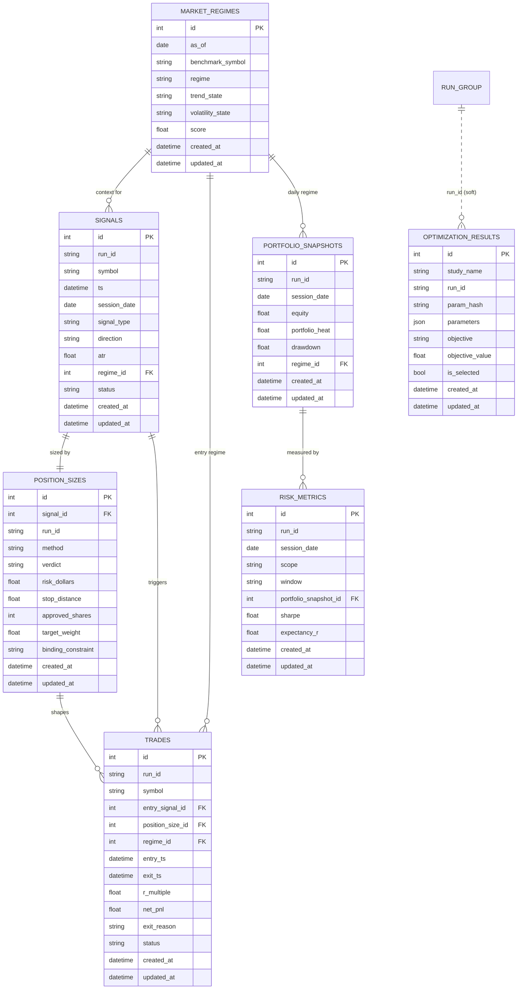

# Database Schema — As Built

The seven core record-keeping tables, implemented as SQLAlchemy 2.0 ORM models
in `src/momentum/persistence/models/` and versioned by Alembic.

> **Verified:** `alembic upgrade head` creates all seven tables on a fresh
> SQLite database, and `alembic check` reports no drift between the models and
> migration `0001_initial_schema`.

| Entity | Table | Model file |
|---|---|---|
| Market Regimes | `market_regimes` | `models/market_regime.py` |
| Signals | `signals` | `models/signal.py` |
| Position Sizes | `position_sizes` | `models/position_size.py` |
| Trades | `trades` | `models/trade.py` |
| Portfolio Snapshots | `portfolio_snapshots` | `models/portfolio_snapshot.py` |
| Risk Metrics | `risk_metrics` | `models/risk_metric.py` |
| Optimization Results | `optimization_results` | `models/optimization_result.py` |

---

## 1. ERD

Foreign keys are solid lines. `optimization_results` links to the other tables
*logically* via the shared `run_id` string (a backtest/live session id), not a
hard FK — shown dashed. Key columns are shown; every table additionally carries
`id` (PK), `created_at` and `updated_at`.



---

## 2. Conventions (apply to every table)

| Concern | Decision |
|---|---|
| **Primary key** | Surrogate `id INTEGER PRIMARY KEY AUTOINCREMENT` (`IntPKMixin`). |
| **Audit timestamps** | `created_at` (server default `CURRENT_TIMESTAMP`, indexed) and `updated_at` (server default + `onupdate`) on every table (`TimestampMixin`). |
| **Run grouping** | `run_id` (indexed string) groups all records from one backtest/live session. A soft reference; in the broader design it FKs a `runs` registry. |
| **Categoricals** | Stored as short `String` with documented allowed values; validated at the application boundary (Pydantic). Keeps SQLite migrations simple and portable. CHECK-constraint hardening is a noted option. |
| **Numerics** | `Float` (SQLite `REAL`) for prices/metrics in research. Production money columns may move to `Numeric` (see §6). |
| **Semi-structured** | `JSON` columns (`features`, `parameters`, `reasons`, `details`) for evolving payloads without schema churn. |
| **Constraint naming** | Deterministic via a `MetaData` naming convention, so Alembic diffs and SQLite batch migrations are stable. |
| **FK on-delete** | `SET NULL` for context links (regime, signal), `CASCADE` for the owning `position_sizes → signals` link. |

---

## 3. Field reference

### 3.1 `market_regimes`
Classifies the market environment per date; everything else can be attributed to it.

| Column | Type | Null | Description |
|---|---|---|---|
| `id` | int | no | PK. |
| `as_of` | date | no | Trading date the classification applies to. |
| `benchmark_symbol` | str(16) | no | Index characterising the market (default `SPY`). |
| `model_version` | str(32) | no | Regime-model version (reproducibility). |
| `regime` | str(16) | no | Headline label: `bull` \| `bear` \| `neutral`. |
| `trend_state` | str(16) | no | `uptrend` \| `downtrend` \| `sideways`. |
| `volatility_state` | str(16) | no | `low` \| `normal` \| `high` \| `extreme`. |
| `score` | float | no | Continuous regime score (−1..+1). |
| `confidence` | float | yes | Model confidence 0..1. |
| `benchmark_close` | float | yes | Benchmark close on `as_of`. |
| `ma_fast` | float | yes | Fast MA (e.g. 50DMA). |
| `ma_slow` | float | yes | Slow MA (e.g. 200DMA) — core trend gate. |
| `adx` | float | yes | Benchmark trend strength. |
| `realized_vol` | float | yes | Annualised benchmark volatility. |
| `breadth` | float | yes | % of universe above 200DMA (optional). |
| `details` | json | yes | Extra indicators/diagnostics. |
| `created_at`/`updated_at` | datetime | no | Audit timestamps. |

**Indexes:** `as_of`, `benchmark_symbol`, `regime`, `created_at`, `(as_of, regime)`.
**Unique:** `(as_of, benchmark_symbol, model_version)`.

### 3.2 `signals`
The strategy's only output — "enter/exit this symbol now", with full feature context.

| Column | Type | Null | Description |
|---|---|---|---|
| `id` | int | no | PK. |
| `run_id` | str(64) | yes | Session grouping key. |
| `source` | str(8) | no | `backtest` \| `paper` \| `live`. |
| `strategy` | str(48) | no | Strategy name/version. |
| `symbol` | str(16) | no | Ticker. |
| `ts` | datetime | no | Timestamp of the closed bar that fired the signal. |
| `session_date` | date | no | Session date (grouping/joins). |
| `signal_type` | str(16) | no | `entry` \| `exit` \| `scale_in` \| `scale_out`. |
| `direction` | str(8) | no | `long` \| `short`. |
| `strength` | float | yes | Signal conviction/score. |
| `momentum_score` | float | yes | Momentum rank used to qualify entry. |
| `breakout_level` | float | yes | Price level broken (N-day high / Donchian). |
| `reference_price` | float | yes | Price at signal (sizing reference). |
| `atr` | float | yes | ATR at signal — feeds stops & sizing. |
| `regime_id` | int FK | yes | → `market_regimes.id` (regime at signal). |
| `features` | json | yes | Full feature vector. |
| `status` | str(16) | no | `generated` \| `accepted` \| `rejected` \| `expired`. |
| `created_at`/`updated_at` | datetime | no | Audit timestamps. |

**Indexes:** `run_id`, `symbol`, `ts`, `session_date`, `signal_type`, `status`, `regime_id`, `created_at`, `(symbol, ts)`, `(run_id, symbol)`.

### 3.3 `position_sizes`
The risk-gateway decision for a signal — the persisted `RiskAssessment`.

| Column | Type | Null | Description |
|---|---|---|---|
| `id` | int | no | PK. |
| `run_id` | str(64) | yes | Session grouping key. |
| `signal_id` | int FK | no | → `signals.id` (unique: one sizing per signal). |
| `symbol` | str(16) | no | Denormalised ticker. |
| `method` | str(32) | no | `fixed_fractional_risk` \| `vol_target` \| `fractional_kelly`. |
| `verdict` | str(8) | no | `approve` \| `resize` \| `veto`. |
| `binding_constraint` | str(48) | yes | Rule that resized/vetoed (e.g. `portfolio_heat`). |
| `reasons` | json | yes | Human-readable reason list. |
| `account_equity` | float | no | Equity at decision time. |
| `risk_per_trade_pct` | float | no | Fraction of equity risked (the R budget). |
| `risk_dollars` | float | no | Dollar value of 1R. |
| `entry_reference` | float | yes | Intended entry price. |
| `stop_price` | float | yes | Initial protective stop. |
| `stop_distance` | float | yes | Entry − stop = risk per share. |
| `atr` | float | yes | ATR used for the stop. |
| `vol_estimate` | float | yes | Annualised vol (vol-target method). |
| `target_shares` | int | yes | Shares before portfolio constraints. |
| `approved_shares` | int | yes | Shares after caps/heat/limits. |
| `target_notional` | float | yes | approved_shares × entry_reference. |
| `target_weight` | float | yes | target_notional / equity. |
| `portfolio_heat_before` | float | yes | Heat before adding the position. |
| `portfolio_heat_after` | float | yes | Projected heat if approved. |
| `created_at`/`updated_at` | datetime | no | Audit timestamps. |

**Indexes:** `run_id`, `signal_id` (unique), `symbol`, `verdict`, `created_at`, `(run_id, verdict)`.

### 3.4 `trades`
Executed position round-trips — the atomic unit of performance analysis.

| Column | Type | Null | Description |
|---|---|---|---|
| `id` | int | no | PK. |
| `run_id` | str(64) | yes | Session grouping key. |
| `symbol` | str(16) | no | Ticker traded. |
| `direction` | str(8) | no | `long` \| `short`. |
| `entry_signal_id` | int FK | yes | → `signals.id` (entry trigger). |
| `position_size_id` | int FK | yes | → `position_sizes.id` (sizing decision). |
| `regime_id` | int FK | yes | → `market_regimes.id` (regime at entry). |
| `entry_ts` | datetime | no | Entry fill timestamp. |
| `exit_ts` | datetime | yes | Exit fill timestamp (NULL while open). |
| `entry_price` | float | no | Average entry fill. |
| `exit_price` | float | yes | Average exit fill. |
| `quantity` | int | no | Shares (absolute). |
| `initial_stop` | float | yes | Initial protective stop. |
| `initial_risk` | float | yes | Dollar value of 1R at entry. |
| `r_multiple` | float | yes | net_pnl / initial_risk — the core metric. |
| `gross_pnl` | float | yes | P&L before costs. |
| `fees` | float | no | Commissions + slippage. |
| `net_pnl` | float | yes | P&L after costs. |
| `return_pct` | float | yes | net_pnl / entry notional. |
| `mae` | float | yes | Max Adverse Excursion. |
| `mfe` | float | yes | Max Favourable Excursion. |
| `holding_days` | int | yes | Calendar days held. |
| `bars_held` | int | yes | Bars held. |
| `exit_reason` | str(24) | yes | `stop`\|`trailing_stop`\|`target`\|`time_stop`\|`signal_exit`\|`regime_exit`\|`manual`. |
| `status` | str(8) | no | `open` \| `closed`. |
| `created_at`/`updated_at` | datetime | no | Audit timestamps. |

**Indexes:** `run_id`, `symbol`, `entry_ts`, `exit_ts`, `status`, FKs, `created_at`, `(symbol, entry_ts)`, `(run_id, status)`.

### 3.5 `portfolio_snapshots`
Point-in-time account state — the equity curve that drives analytics and the drawdown throttle.

| Column | Type | Null | Description |
|---|---|---|---|
| `id` | int | no | PK. |
| `run_id` | str(64) | yes | Session grouping key. |
| `as_of` | datetime | no | Snapshot timestamp. |
| `session_date` | date | no | Session date (one snapshot per run/date). |
| `equity` | float | no | Total account value (the curve). |
| `cash` | float | no | Uninvested cash. |
| `positions_value` | float | no | Market value of open positions. |
| `num_positions` | int | no | Open position count. |
| `gross_exposure` | float | no | Σ\|notional\| / equity. |
| `net_exposure` | float | no | Σ signed notional / equity. |
| `long_exposure` | float | no | Long notional / equity. |
| `short_exposure` | float | no | Short notional / equity. |
| `leverage` | float | no | Gross notional / equity. |
| `portfolio_heat` | float | no | Aggregate open risk / equity — headline risk gauge. |
| `realized_pnl` | float | no | Cumulative realised P&L. |
| `unrealized_pnl` | float | no | Open mark-to-market P&L. |
| `daily_pnl` | float | yes | P&L this session. |
| `daily_return` | float | yes | Fractional return this session. |
| `cumulative_return` | float | yes | Return since inception. |
| `high_water_mark` | float | yes | Peak equity to date. |
| `drawdown` | float | yes | Current drawdown from HWM (≤ 0). |
| `regime_id` | int FK | yes | → `market_regimes.id`. |
| `created_at`/`updated_at` | datetime | no | Audit timestamps. |

**Indexes:** `run_id`, `as_of`, `session_date`, `regime_id`, `created_at`, `(run_id, as_of)`.
**Unique:** `(run_id, session_date)`.

### 3.6 `risk_metrics`
Computed risk/return metrics for a scope over a window; decoupled from the raw curve so it can be recomputed/backfilled.

| Column | Type | Null | Description |
|---|---|---|---|
| `id` | int | no | PK. |
| `run_id` | str(64) | yes | Session grouping key. |
| `as_of` | datetime | no | Computation time / period end. |
| `session_date` | date | no | Session the metrics describe. |
| `scope` | str(16) | no | `portfolio` \| `strategy` \| `symbol`. |
| `window` | str(24) | no | `daily`\|`rolling_30d`\|`rolling_90d`\|`rolling_252d`\|`inception`. |
| `portfolio_snapshot_id` | int FK | yes | → `portfolio_snapshots.id`. |
| `volatility_annual` | float | yes | Annualised volatility. |
| `downside_deviation` | float | yes | Annualised downside deviation. |
| `sharpe` | float | yes | Annualised Sharpe. |
| `sortino` | float | yes | Annualised Sortino. |
| `calmar` | float | yes | CAGR / \|max DD\|. |
| `max_drawdown` | float | yes | Worst peak-to-trough over window. |
| `current_drawdown` | float | yes | Drawdown at `as_of`. |
| `ulcer_index` | float | yes | Depth+duration drawdown stress. |
| `var_95` | float | yes | 95% Value at Risk. |
| `cvar_95` | float | yes | 95% Conditional VaR / expected shortfall. |
| `beta` | float | yes | Beta vs benchmark. |
| `correlation_benchmark` | float | yes | Return correlation with benchmark. |
| `gross_exposure` | float | yes | Gross exposure at measurement. |
| `portfolio_heat` | float | yes | Open-risk fraction at measurement. |
| `win_rate` | float | yes | Fraction of winning trades. |
| `profit_factor` | float | yes | Gross profit / gross loss. |
| `expectancy_r` | float | yes | Average R per trade — core edge metric. |
| `avg_win_r` | float | yes | Average winner (R). |
| `avg_loss_r` | float | yes | Average loser (R, negative). |
| `payoff_ratio` | float | yes | \|avg_win_r / avg_loss_r\|. |
| `num_trades` | int | yes | Sample size. |
| `details` | json | yes | Extra/experimental metrics. |
| `created_at`/`updated_at` | datetime | no | Audit timestamps. |

**Indexes:** `run_id`, `as_of`, `session_date`, `scope`, `portfolio_snapshot_id`, `created_at`, `(scope, session_date)`.
**Unique:** `(run_id, scope, window, session_date)`.

### 3.7 `optimization_results`
One row per parameter set evaluated in a study — with objective, fold/sample and headline metrics.

| Column | Type | Null | Description |
|---|---|---|---|
| `id` | int | no | PK. |
| `study_name` | str(64) | no | Optimization study/experiment. |
| `optimizer` | str(24) | no | `grid` \| `random` \| `optuna_tpe` \| … |
| `run_id` | str(64) | yes | Backtest run produced for this set (links to trades/snapshots). |
| `param_hash` | str(64) | no | Stable hash of `parameters` (dedupe). |
| `parameters` | json | no | The exact parameter set evaluated. |
| `objective` | str(32) | no | Metric optimised (`sharpe`, `expectancy_r`, …). |
| `objective_value` | float | yes | Score on the objective (indexed). |
| `sample` | str(16) | no | `in_sample` \| `out_of_sample` \| `full`. |
| `fold` | int | yes | Walk-forward fold index. |
| `window_start` | date | yes | Data window start. |
| `window_end` | date | yes | Data window end. |
| `cagr` | float | yes | Compound annual growth rate. |
| `sharpe` | float | yes | Annualised Sharpe. |
| `sortino` | float | yes | Annualised Sortino. |
| `calmar` | float | yes | CAGR / \|max DD\|. |
| `max_drawdown` | float | yes | Worst decline. |
| `volatility_annual` | float | yes | Annualised volatility. |
| `win_rate` | float | yes | Fraction of winners. |
| `profit_factor` | float | yes | Gross profit / gross loss. |
| `expectancy_r` | float | yes | Average R per trade. |
| `num_trades` | int | yes | Trade count (significance). |
| `turnover` | float | yes | Portfolio turnover (cost sensitivity). |
| `rank` | int | yes | Rank within study on objective. |
| `is_selected` | bool | no | Chosen for deployment. |
| `details` | json | yes | Per-fold breakdown / secondary metrics. |
| `created_at`/`updated_at` | datetime | no | Audit timestamps. |

**Indexes:** `study_name`, `run_id`, `param_hash`, `objective_value`, `is_selected`, `created_at`, `(study_name, objective_value)`.
**Unique:** `(study_name, param_hash, sample, fold)`.

---

## 4. Relationships

| From | → To | Cardinality | On delete |
|---|---|---|---|
| `signals.regime_id` | `market_regimes.id` | many→one | SET NULL |
| `position_sizes.signal_id` | `signals.id` | one→one | CASCADE |
| `trades.entry_signal_id` | `signals.id` | many→one | SET NULL |
| `trades.position_size_id` | `position_sizes.id` | many→one | SET NULL |
| `trades.regime_id` | `market_regimes.id` | many→one | SET NULL |
| `portfolio_snapshots.regime_id` | `market_regimes.id` | many→one | SET NULL |
| `risk_metrics.portfolio_snapshot_id` | `portfolio_snapshots.id` | many→one | SET NULL |
| `optimization_results.run_id` | *(session group)* | soft | — |

Full lineage of a trade: `market_regime → signal → position_size → trade`, with the daily `portfolio_snapshot → risk_metrics` series alongside, all tied together by `run_id`.

---

## 5. Migration plan (Alembic)

Alembic is configured at the repo root (`alembic.ini`) with the environment in
`src/momentum/persistence/migrations/`. The environment imports the ORM metadata,
prefers `DATABASE_URL` over the ini, and uses **batch mode** so SQLite `ALTER`s
work and the same migrations run on Postgres in production.

**Status:** migration `0001_initial_schema` is generated and **verified** —
`alembic upgrade head` builds all seven tables and `alembic check` reports no
drift from the models.

### Everyday commands
```bash
alembic upgrade head                       # apply all migrations
alembic downgrade -1                        # roll back one revision
alembic downgrade base                      # roll back everything
alembic revision --autogenerate -m "msg"   # author a new migration from model changes
alembic check                              # CI guard: fail if models != migrations
alembic history --verbose                   # audit the migration timeline
alembic current                             # show the DB's current revision
```

### Change workflow
1. Edit/add an ORM model under `models/`.
2. `alembic revision --autogenerate -m "describe change"`.
3. **Review** the generated script (autogenerate is a draft — verify index/constraint changes, add data backfills if needed).
4. Commit the migration alongside the model change (they travel together).
5. `alembic upgrade head` locally; CI runs `upgrade head` on a fresh DB **and** `alembic check`.

### Ordering & rollback
- Table create/drop order is derived from FK dependencies automatically
  (`market_regimes` → `signals` → `position_sizes`/`portfolio_snapshots` →
  `trades` → `risk_metrics`; `optimization_results` is independent).
- `downgrade()` drops in reverse; index drops use `batch_alter_table` for SQLite.
- Each migration is one transaction where the backend supports transactional DDL.

### Production / scale notes
- **Engine:** point `DATABASE_URL` at Postgres; migrations are unchanged.
- **Money precision:** consider migrating price/P&L `Float` → `Numeric(18,6)` for live accounting.
- **Growth tables** (`signals`, `portfolio_snapshots`, `risk_metrics`): already
  indexed on `session_date`/`run_id`; archive or partition by `run_id`/date as
  volume grows. Retire old research runs by `run_id`.
- **Integrity:** the app enables `PRAGMA foreign_keys=ON` (SQLite); Postgres
  enforces FKs natively.

---

## 6. Reconciliation with the design doc

[DATA_MODEL.md](DATA_MODEL.md) describes the broader target schema. This document
is the **as-built** subset for the seven requested entities, with two naming
refinements adopted from the request:

| DATA_MODEL.md (design) | As built (here) |
|---|---|
| `equity_curve` | `portfolio_snapshots` |
| `risk_assessments` | `position_sizes` |
| *(new)* | `market_regimes`, `risk_metrics`, `optimization_results` |

The remaining design tables (`instruments`, `daily_bars`, `orders`, `fills`,
etc.) stay as scaffold for later phases per the [roadmap](ROADMAP.md).
