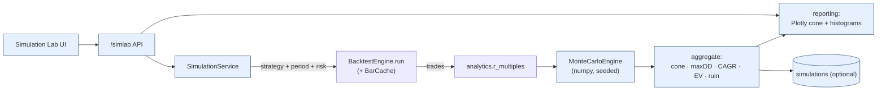

# Simulation Lab — UI & Implementation Plan

Run a strategy over a chosen capital base, period and risk profile, then **stress
its outcome distribution with Monte Carlo** — so you see not one equity curve but
the *range of plausible outcomes* and the probability of the bad ones.

> **Status:** design (UI + implementation plan). No implementation yet.

## 1. What it is — and how it differs from the Strategy Lab

| | Strategy Lab | **Simulation Lab** |
|---|---|---|
| Question | "Which **parameter set** is better?" (A/B) | "How **robust / lucky** was this one result, and what's the risk?" |
| Method | run versions, compare metrics | take one config's **trade sequence** and **resample it** thousands of times |
| Output | side-by-side version metrics | outcome **distributions**: equity cone, max-DD dist, CAGR dist, EV, risk of ruin |

The front half (pick capital / dates / strategy / risk → backtest → trades) **reuses
the same machinery** as the Strategy Lab. The new value is the **Monte Carlo engine**
on top of the resulting trade sequence.

## 2. Inputs (what the user selects)

| Selection | Source / binding |
|---|---|
| **Starting Capital** | `BacktestConfig.initial_cash` |
| **Date Range** | backtest window (bars from the cache) |
| **Strategy** | a saved **Strategy Lab version** *or* an effective config |
| **Risk Parameters** | risk `risk_per_trade_pct`, `initial_atr_multiple`, `max_portfolio_heat`, … |
| Monte Carlo controls | `n_paths` (1k–50k), `method`, `block_len`, `horizon` (# trades), `ruin_drawdown` (e.g. −50%), `seed`, `sizing_mode` |

## 3. Outputs (the six required, all from one run)

| Output | How it is produced |
|---|---|
| **Equity Curve** | the actual backtest curve, overlaid with the MC **percentile cone** (5/25/50/75/95) |
| **Max Drawdown** | distribution of each path's max DD → median, 95th-pctile (worst), `P(maxDD > X)` |
| **Annual Return** | distribution of each path's CAGR → median + 90% CI; mean = EV of annual return |
| **Trade Distribution** | histogram of the observed **R-multiples** (the resampling unit) |
| **Expected Value** | per-trade EV = `mean(R)·risk$`; horizon EV = `mean(terminal wealth) − capital` (+ CI) |
| **Monte Carlo Simulations** | the engine that yields all of the above as distributions, plus risk of ruin, `P(profit)` |

---

## 4. UI wireframes

### 4.1 Setup

```
┌─ Simulation Lab ───────────────────────────────────────────────────────────────────┐
│ ┌─ Inputs ───────────────────────────────┐ ┌─ Monte Carlo ────────────────────────┐ │
│ │ Starting capital  [ $100,000 ]         │ │ Paths        [ 10,000 ▾ ]            │ │
│ │ Date range        [2015-01 .. 2024-12] │ │ Method       (•) IID bootstrap       │ │
│ │ Strategy          [ v7 tighter-stops ▾]│ │              ( ) Block bootstrap [20] │ │
│ │ Universe          [ S&P 1500 ▾ ]       │ │              ( ) Shuffle (reorder)    │ │
│ │ ▸ Risk parameters                      │ │              ( ) Parametric (fit R)   │ │
│ │   Risk %          [ 0.75% ] ●─○──────  │ │ Sizing       (•) flat risk %          │ │
│ │   ATR multiple    [ 2.5 ]              │ │              ( ) replay recorded $     │ │
│ │   Max heat        [ 6% ]              │ │ Horizon      [ = observed (206) ]     │ │
│ │                                        │ │ Ruin at DD   [ −50% ]   Seed [ 42 ]   │ │
│ └────────────────────────────────────────┘ └───────────────────────────────────────┘ │
│  effective config #a91f…  ·  data cached ✓             [ ▶ Run simulation ]           │
└──────────────────────────────────────────────────────────────────────────────────────┘
```

### 4.2 Results dashboard

```
┌─ Results · v7 · $100k · 2015–2024 · 10,000 paths (IID bootstrap, seed 42) ───────────┐
│ ┌─ Equity curve + Monte Carlo cone (log) ───────────────────────────────────────────┐│
│ │  $   ┊                                                    ╱╱╱ p95              │     ││
│ │      ┊                                          ░░░░░░░░╱╱   p75              │     ││
│ │      ┊                                ░░░░▒▒▒▒▓▓▓▓▒▒▒▒░░  median ── actual ━━ │     ││
│ │      ┊                      ░░░░▒▒▒▒▓▓                    p25              │     ││
│ │      ┊            ░░░░▒▒▒▒                              ╲╲╲ p5               │     ││
│ │      └────────────────────────────────────────────────────────────────▶ trades   ││
│ └────────────────────────────────────────────────────────────────────────────────────┘│
│ ┌─ Max drawdown ─────────────┐ ┌─ Annual return (CAGR) ──────┐ ┌─ Trade R dist ──────┐│
│ │ median  -16%               │ │ median  18.5%               │ │      ▁▂▃▅▇▆▃▂▁       ││
│ │ p95     -31%   (worst tail)│ │ 90% CI  [ 6% , 32% ]        │ │  -1R   0    +3R  +8R ││
│ │ P(DD>20%)  28%   ▓▓▓░░░░░░░ │ │ EV(ann) 19.1%               │ │ mean +0.62R · n 206 ││
│ │ actual  -19%   │           │ │ actual  19.0% │             │ │ skew + (fat right)  ││
│ └────────────────────────────┘ └─────────────────────────────┘ └─────────────────────┘│
│ ┌─ Expected value & risk ───────────────────────────────────────────────────────────┐│
│ │ Per-trade EV  +$469 (0.62R · $750)   Terminal wealth: median $487k · mean $604k    ││
│ │ Horizon EV    +$504,000              90% CI [ $212k , $1.36M ]                      ││
│ │ P(profit) 91%   ·   Risk of ruin (−50% DD) 3.2%   ·   P(2× capital) 64%            ││
│ └────────────────────────────────────────────────────────────────────────────────────┘│
│  ⚠ 206 trades · IID ignores streak autocorrelation — see Block/Shuffle.  [ ⭳ CSV ]   │
└────────────────────────────────────────────────────────────────────────────────────────┘
```

---

## 5. Monte Carlo methodology (the core)

**Resampling unit = per-trade R-multiples** (`analytics.r_multiples(trades)`). R
preserves the strategy's actual payoff shape (the fat right tail this platform
optimizes for) and is sizing-agnostic until we apply risk %.

**Methods**

| Method | Draw | Reveals |
|---|---|---|
| **IID bootstrap** | sample R **with replacement** | luck of the *sample* (clean, optimistic; ignores autocorrelation) |
| **Block bootstrap** (`block_len`) | resample contiguous R blocks | preserves short-run **streaks / autocorrelation** |
| **Shuffle / permutation** | reorder the *observed* R **without replacement** | pure **path/order risk** — same trades, different sequence (max DD & ruin are order-dependent) |
| **Parametric** | sample a distribution fit to R | smooth tails (secondary / sanity check) |

**Path generation** (vectorized over `n_paths × horizon`), per step *i*:
```
risk$_i   = equity_{i-1} · risk_per_trade_pct       # flat-risk sizing mode
pnl_i     = R_i · risk$_i                            # or: replay recorded risk$ per trade
equity_i  = equity_{i-1} + pnl_i
```
`sizing_mode = replay recorded $` uses each trade's stored `position_sizes.risk_dollars`
instead of a flat % (so conviction/vol-scaled sizing is respected).

**Aggregation across paths**
- **Equity cone:** per-step percentiles [5,25,50,75,95] → bands.
- **Max DD dist:** `max_drawdown(path)` per path → median, p95 (worst), `P(maxDD > threshold)`.
- **CAGR dist:** `(terminal/capital)^(1/years) − 1` → median, 90% CI, mean (EV of annual return).
- **Terminal wealth dist:** median, **mean = EV**, 90% CI, `P(terminal>capital)=P(profit)`, `P(≥2×)`.
- **Risk of ruin:** `P(path min equity ≤ capital·(1+ruin_drawdown))`.

**Reproducibility:** a seeded `numpy.random.Generator`; the seed + `config_hash` are
recorded so a simulation is reproducible bit-for-bit.

---

## 6. Architecture (reuses existing platform)



`SimulationService` can also skip the backtest and pull an **existing `run_id`'s
trades** (e.g. simulate a Strategy Lab version that already ran).

---

## 7. Implementation plan (phased)

**`src/momentum/simulation/`** (new package; pure logic first, fully testable).

| Phase | Module / change | Contents | Exit criteria |
|---|---|---|---|
| **1** | `montecarlo.py` | `McSettings` (Pydantic: n_paths, method, block_len, horizon, ruin_drawdown, sizing_mode), and pure `MonteCarloEngine.simulate(r_multiples, *, starting_capital, risk_per_trade_pct, seed) -> McResult` (numpy-vectorized; `McResult` holds terminal_wealth/cagr/max_drawdown arrays + equity-percentile frame + summary). | seeded determinism; degenerate inputs (0/1 trades) handled; tests for each method + EV/ruin math |
| **2** | `inputs.py`, `service.py` | `SimulationRequest` (frozen) + `SimulationService.run(request, session)` — obtain trades (run backtest via engine+cache **or** load `run_id`), extract R, run engine, assemble `SimulationResult` (actual metrics + MC distributions). | end-to-end run from a config or a saved version |
| **3** | `reporting/simulation_charts.py` | Plotly: equity **cone** (bands + actual), max-DD histogram, CAGR histogram, terminal-wealth histogram, R-distribution. | a run renders the §4.2 dashboard figures |
| **4** (opt) | `persistence`: `simulations` table + repo + migration (`add-migration`) | request params, `config_hash`, seed, summary stats, percentile JSON — for reproducible, shareable sims. | sim persists & reloads; `alembic check` clean |
| **5** | `api/routes/simlab.py` + schemas | `POST /simlab/run`, `GET /simlab/{id}`, `GET /simlab/{id}/paths`, `GET /simlab/{id}/chart`. | dashboard served end-to-end |
| **6** | UI (server-rendered Plotly v1, SPA later) | setup form (schema-driven, reuses Strategy Lab param schema) + results dashboard. | the four selections → the six outputs from the browser |

Use the repo's `add-subsystem` scaffold for `momentum.simulation` and `add-migration`
for the optional table. Pure `MonteCarloEngine` is the highest-value, most-tested unit.

### Optional data model — `simulations`
| Group | Columns |
|---|---|
| Identity | `id`, `created_at`, `updated_at`, `label`, `run_id?`, `strategy_version_id?` |
| Inputs | `starting_capital`, `period_start`, `period_end`, `params` (JSON: risk + MC settings), `config_hash`, `seed` |
| Summary | `n_paths`, `median_cagr`, `cagr_p05`, `cagr_p95`, `median_max_dd`, `max_dd_p95`, `prob_profit`, `risk_of_ruin`, `ev_terminal`, `median_terminal`, `num_trades` |
| Detail | `percentiles` (JSON: equity cone), `distributions` (JSON: binned CAGR / maxDD) |

---

## 8. API contract

| Endpoint | Body / query | Returns |
|---|---|---|
| `POST /simlab/run` | `{starting_capital, period, strategy_ref, risk{}, mc{}}` | `{simulation_id, summary}` (sync for ≤10k paths; async option for large) |
| `GET /simlab/{id}` | — | full `SimulationResult` (actual metrics + MC summary) |
| `GET /simlab/{id}/paths` | `percentiles?` | equity cone + per-path arrays (downsampled) |
| `GET /simlab/{id}/chart` | `kind=cone|maxdd|cagr|terminal|rdist` | server-rendered Plotly HTML |

---

## 9. Self-critique / caveats (surfaced in the UI)

- **Stationarity / exchangeability.** IID bootstrap assumes trades are independent and
  identically distributed — markets aren't (regimes, serial dependence). Block bootstrap
  partially fixes autocorrelation; **Shuffle** isolates order risk. The UI defaults to
  IID but nudges toward Block/Shuffle and labels IID's optimism.
- **Garbage-in.** MC is conditional on the backtest's trade sample being representative;
  an **overfit** backtest yields a falsely tight, rosy cone. Pair with **walk-forward**
  (Strategy Lab) and **warn when `num_trades` is small** (wide, unreliable tails).
- **Sizing realism.** Flat-risk-% compounding is the default; `replay recorded $` mode
  uses stored per-trade `risk_dollars` so conviction/vol-scaled sizing isn't lost.
- **Horizon extrapolation.** Simulating more trades than observed extrapolates the
  distribution; default `horizon = observed count`, and longer horizons are flagged.
- **Objective consistency.** Rankings/EV emphasize the platform's **positive-skew**
  payoff (expectancy, terminal-wealth tail, risk of ruin) — win rate is shown, not
  optimized.
- **Compute.** `n_paths × horizon` draws are a single vectorized numpy matrix; 10k×200
  is milliseconds. Very large runs (50k+) get the async path.
