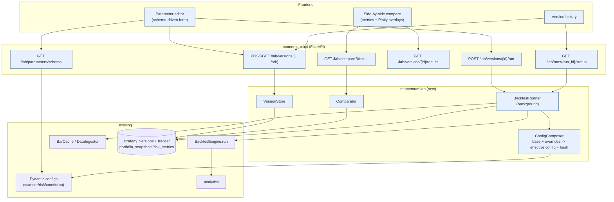
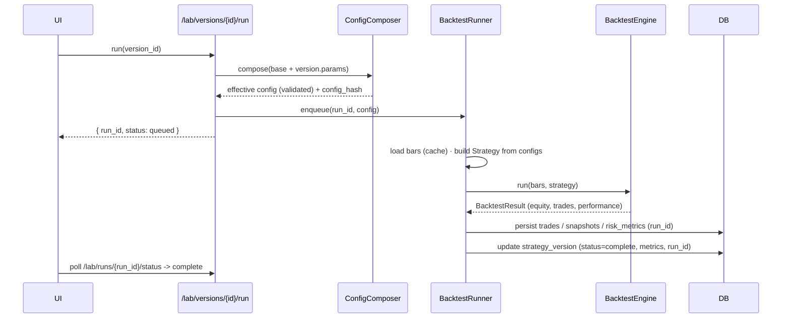

# Strategy Lab — Architecture & UI

An interactive surface for **tuning strategy parameters, running backtests, and
comparing strategy versions side-by-side** — with full version history. The Lab
turns the platform's config classes and backtest engine into a research console.

> **Status:** design (architecture + UI). No implementation yet.

## 1. What it composes (the key fact)

Every moving part already exists; the Lab is an **editor + runner + comparator** on
top of them:

| Lab capability | Built on |
|---|---|
| Editable parameters | the immutable **Pydantic config classes** (`ScannerConfig`, `ConvictionConfig`, risk config) — the single source of truth |
| Run a backtest | `BacktestEngine(BacktestConfig).run(bars, strategy) -> BacktestResult` |
| Price data | the market-data cache (`BarCache` / `DataIngestor`) |
| Metrics | `analytics` (`PerformanceReport`, `compute_trade_stats`) — already on `BacktestResult` |
| Per-run records | `trades`, `portfolio_snapshots`, `risk_metrics` keyed by `run_id` (so Trade Replay & the performance API work on Lab runs too) |
| Metric vocabulary for comparison | the `optimization_results` schema (cagr/sharpe/expectancy_r/…) |

New persistence is only the **`strategy_versions`** table (the version history).

---

## 2. Editable parameters

The form is **generated from the config models' field metadata** (name, type,
default, bounds, description) — no hardcoded UI. The five named examples plus the
rest of the high-value tunables:

| Parameter | Source config field | Type · range · default | Effect |
|---|---|---|---|
| **RVOL Threshold** | `ScanFilters.min_relative_volume` | float ≥ 0 · `1.0` | min volume vs trailing avg to qualify |
| **ATH Distance** | `ScanFilters.max_distance_from_ath` | float 0–1 · `0.25` | max gap below all-time high |
| **Conviction Threshold** | *new gate* `min_conviction_score` (consumes the conviction engine) | float 0–100 · `0` | minimum conviction to take a trade |
| **Risk %** | risk `sizing.risk_per_trade_pct` | float 0–0.05 · `0.0075` | equity risked per trade (the R unit) |
| **ATR Multiplier** | risk `stops.initial_atr_multiple` | float > 0 · `2.5` | initial stop distance = k·ATR |
| Breakout lookback | `ScannerConfig` / strategy | int > 0 · `50` | N-day-high breakout window |
| Momentum lookback | `ScannerConfig.momentum_lookbacks` | dict · `{63,126,252}` | blended momentum windows |
| Min dollar volume | `ScanFilters.min_dollar_volume` | float ≥ 0 · `20M` | liquidity floor |
| Trailing stop mult | risk `stops.chandelier_atr_multiple` | float > 0 · `3.0` | trail distance |
| Max portfolio heat | risk `portfolio_limits.max_portfolio_heat` | float 0–1 · `0.06` | aggregate open-risk cap |
| Max sector weight | risk `portfolio_limits.max_sector_weight` | float 0–1 · `0.35` | concentration cap |

A **`/lab/parameters/schema`** endpoint introspects these models so the UI renders
the right widget (slider / number / toggle) with validation bounds for each.

---

## 3. UI wireframes

### 3.1 Lab — parameter editor & run

```
┌─ Strategy Lab ─────────────────────── version: [ v7 · "tighter-stops" ▼ ]  [ + fork ] ┐
│ ┌─ Parameters ──────────────────────────────┐ ┌─ Run ──────────────────────────────┐ │
│ │ ▸ Universe / Scanner                       │ │ Universe   [ S&P 1500 ▼ ]          │ │
│ │   RVOL threshold     [1.5]  ●───────○  0–5 │ │ Period     [2015-01-01 .. 2024-12] │ │
│ │   ATH distance       [0.15] ●──○──────  0–1│ │ Bars       daily (cached)          │ │
│ │   Min $ volume       [20M]  ●───○─────      │ │ Initial $  [100,000]               │ │
│ │ ▸ Signal                                   │ │ Costs      5bps slip · $0.005/sh    │ │
│ │   Breakout lookback  [ 50 ]                 │ │ Seed       [42]                    │ │
│ │   Momentum lookback  [63/126/252]          │ │ ───────────────────────────────── │ │
│ │ ▸ Conviction                               │ │ effective config #a91f… (valid ✓)  │ │
│ │   Conviction thresh  [ 70 ]  ●──────○─ 0–100│ │                                    │ │
│ │ ▸ Risk                                     │ │      [ ▶ Run backtest ]            │ │
│ │   Risk %             [0.0075] ●─○──────     │ │      [ ⮂ Run vs baseline v3 ]      │ │
│ │   ATR multiplier     [ 2.5 ] ●───○────      │ │                                    │ │
│ │   Trailing stop mult [ 3.0 ]               │ │ last run: ✓ complete · 3.1s        │ │
│ │   Max portfolio heat [0.06]  ●──○─────      │ │ CAGR 19% · Sharpe 1.3 · PF 2.1     │ │
│ └────────────────────────────────────────────┘ └─────────────────────────────────────┘ │
│  base config: risk.yaml · scanner.yaml · conviction.yaml   diff vs base: 5 fields ▸     │
└──────────────────────────────────────────────────────────────────────────────────────┘
```

### 3.2 Version history

```
┌─ Versions ─────────────────────────────────────────────── study: breakout_lab ─────┐
│ ☑  Label              Parent  Created     Status   CAGR  Sharpe  Exp(R)  MaxDD  #Tr   │
│ ☑  v7 tighter-stops   v3      02/14 10:22  ✓ done   21%   1.45   +0.71  -14%   182  ▸ │
│ ☑  v3 baseline        v1      02/12 16:05  ✓ done   19%   1.30   +0.62  -19%   206  ▸ │
│ ☐  v6 high-conviction v3      02/14 09:40  ✓ done   17%   1.51   +0.95  -11%    74  ▸ │
│ ☐  v5 loose-rvol      v3      02/13 14:11  ✓ done   16%   1.05   +0.40  -23%   349  ▸ │
│ ☐  v8 wide-stops      v7      02/14 11:01  �running… ─     ─       ─      ─      ─     │
├──────────────────────────────────────────────────────────────────────────────────────┤
│  [ Open ]  [ Fork ]  [ Re-run ]  [ Compare selected (2) ]  [ ⭳ export params ]        │
└──────────────────────────────────────────────────────────────────────────────────────┘
```

### 3.3 Side-by-side comparison

Same dataset/period is **pinned** across versions for a fair test. Best per row ★.

```
┌─ Compare ─ pinned dataset: S&P1500 · 2015–2024 · daily ────────────────────────────┐
│ Metric                v3 baseline      v7 tighter-stops     v6 high-conviction       │
│ ───────────────────── ───────────────  ──────────────────   ─────────────────────── │
│ CAGR                   19.0%            21.0%  ▲+2.0  ★       17.0%  ▼-2.0            │
│ Sharpe                 1.30             1.45   ▲+.15          1.51   ▲+.21  ★         │
│ Expectancy (R)         +0.62            +0.71  ▲+.09          +0.95  ▲+.33  ★         │
│ Profit factor          2.10             2.35   ▲              2.80   ▲     ★          │
│ Max drawdown          -19.0%           -14.0%  ▲ (better)    -11.0%  ▲ ★             │
│ Win rate               41%              44%                   38%                     │
│ # trades               206              182                   74                      │
│ Avg / Largest winner   $2.1k / $14k     $2.3k / $15k          $3.4k / $22k ★          │
│ Trend capture          58%              61%                   67%  ★                  │
│ ───────────────────── ───────────────  ──────────────────   ─────────────────────── │
│ ┌─ Equity curves (overlay, log) ──────────┐ ┌─ R-multiple distribution ───────────┐ │
│ │            ╱v6                            │ │  v3 ▁▂▃▅▇▅▃▂  v7 ▁▂▄▆▇▆▃  v6 ▁▁▂▃▅▇ │ │
│ │       ╱v7 ╱                               │ │  (v6: fewer, fatter right tail)     │ │
│ │   ╱v3╱──                                  │ │                                     │ │
│ └──────────────────────────────────────────┘ └─────────────────────────────────────┘ │
│  Primary objective: positive skew (expectancy · profit factor · largest winner) —     │
│  win rate is shown, never ranked.                          [ ⭳ CSV ] [ set baseline ] │
└────────────────────────────────────────────────────────────────────────────────────────┘
```

---

## 4. System architecture

New pieces shaded; everything else is existing platform.



### Run sequence



Forking a version writes a child row with `parent_id`, giving a lineage tree.

---

## 5. API contract (extends `momentum.api`, read + run)

| Endpoint | Body / query | Returns |
|---|---|---|
| `GET /lab/parameters/schema` | — | editable param catalog (field, type, bounds, default, group) from the config models |
| `GET /lab/versions` | `study`, `status` | version rows (history grid) |
| `POST /lab/versions` | `{label, parent_id?, params{}}` | created version (params validated; `config_hash`) |
| `GET /lab/versions/{id}` | — | version detail (params, lineage, last result) |
| `PATCH /lab/versions/{id}` | `{label?, notes?}` | updated metadata |
| `POST /lab/versions/{id}/run` | `{dataset, period, seed?}` | `{run_id, status}` (async) |
| `GET /lab/runs/{run_id}/status` | — | `{status, progress, error?}` |
| `GET /lab/versions/{id}/results` | — | metrics summary + equity-curve ref + trades ref |
| `GET /lab/compare` | `ids=1,2,3`, `metric` | aligned metric table + equity curves + R-distributions |

Validation: `POST /versions` runs the params through the Pydantic validators (e.g.
`ema_fast<ema_mid<ema_slow`, weight sums); failures return **field-level errors** the
form highlights inline.

---

## 6. Data model — `strategy_versions` (new)

| Group | Columns |
|---|---|
| Identity | `id`, `created_at`, `updated_at`, `study_name`, `label`, `notes` |
| Lineage | `parent_id` → `strategy_versions.id` (fork tree) |
| Config | `params` (JSON: the overrides vs base), `base_config_hash`, `config_hash` |
| Run | `status` (draft/queued/running/complete/failed), `run_id`, `dataset`, `period_start`, `period_end`, `rng_seed` |
| Metrics (denormalized for fast grids) | `final_equity`, `cagr`, `sharpe`, `sortino`, `calmar`, `max_drawdown`, `expectancy_r`, `profit_factor`, `win_rate`, `num_trades`, `avg_winner`, `largest_winner`, `trend_capture` |

Indexes: `config_hash`, `status`, `parent_id`, `(study_name, created_at)`. The full
per-run detail (trades, equity curve) lives in the existing `run_id`-keyed tables, so
the Lab reuses the performance API, analytics and **Trade Replay** unchanged.

> Reuse note: `optimization_results` remains the store for *automated* parameter
> sweeps (the optimizer / walk-forward). `strategy_versions` is the *human-driven*,
> labeled, forkable history. Both share the metric vocabulary, so a promising swept
> set can be imported as a named version.

---

## 7. Tech & phased roadmap

**Stack reuse:** Pydantic configs (param schema source of truth), the backtest
engine, the bar cache, analytics, FastAPI, Plotly. v1 needs no new runtime dependency.

| Phase | Deliverable | Exit criteria |
|---|---|---|
| 1 | `ConfigComposer` (base + overrides → validated effective config + hash) + `/lab/parameters/schema` | invalid overrides rejected with field errors; hash stable |
| 2 | `strategy_versions` table + repository + `VersionStore` + CRUD/fork API | versions persist, fork lineage works |
| 3 | `BacktestRunner` (background) wiring engine + cache; persist run + version metrics | a version runs end-to-end; status polling |
| 4 | `Comparator` + `/lab/compare` + Plotly equity/R-dist overlays | 2–4 versions compared on a pinned dataset |
| 5 | UI: schema-driven editor, version history, side-by-side | the five example params tune & compare from the browser |

**Reproducibility:** every run records `config_hash` + git commit + `rng_seed`, so any
version is re-runnable bit-for-bit — consistent with the platform's audit story.

---

## 8. Self-critique / open questions

- **Overfitting risk.** A Lab makes curve-fitting easy. Mitigations baked into the
  design: the comparison's **primary objective is positive skew** (expectancy · profit
  factor · largest winner), win rate is shown but never ranked; and the compare view
  should surface **out-of-sample / walk-forward** splits (the optimizer already has
  `walk_forward`) with an in-sample warning.
- **Fair comparison.** Versions must be compared on a **pinned dataset, period and
  seed**; the compare view enforces this and flags mismatches.
- **Long runs.** v1 uses an in-process background task with status polling — simple but
  not restart-durable; production wants a real job queue (and run cancellation).
- **Conviction Threshold** introduces a new entry gate (`min_conviction_score`) that
  consumes the existing conviction engine — a small addition to the strategy/risk gate,
  noted so it isn't mistaken for an existing field.
- **Parameter coupling.** Some params interact (e.g. tighter RVOL + higher conviction
  shrinks trade count); the Lab should warn when `num_trades` drops below a
  significance floor so thin samples aren't over-interpreted.

When implemented, follow the repo's `add-subsystem` / `add-migration` conventions for
`momentum.lab` and the `strategy_versions` table.
