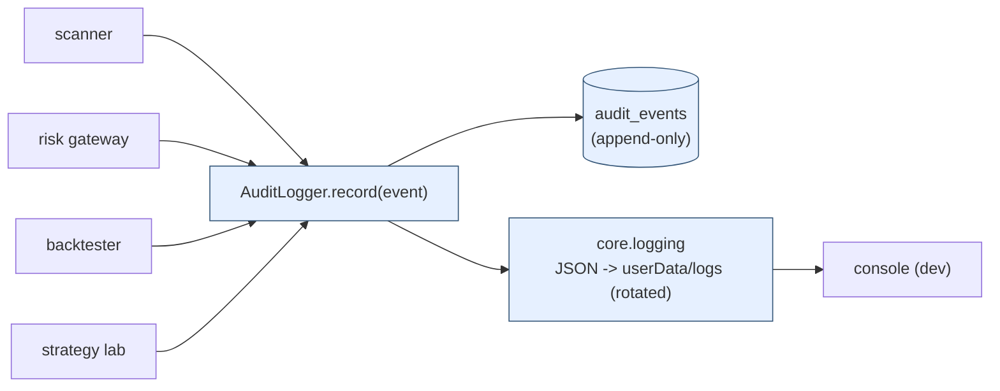
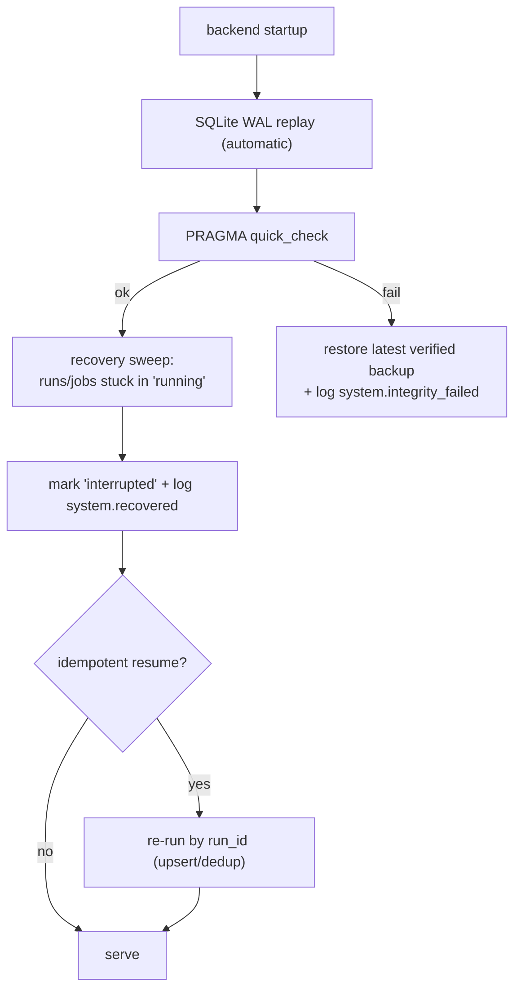
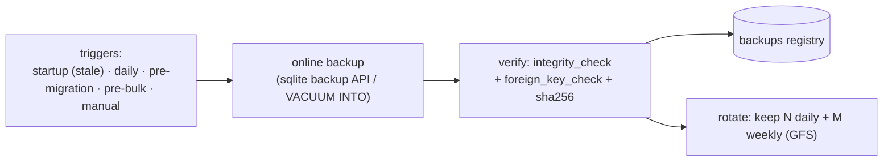

# System Logging, Recovery & Integrity — Architecture

Make the platform **fully auditable and crash-safe**: every scan, trade, backtest and
strategy change is logged to an immutable trail; the system recovers cleanly from a
crash; the database is backed up automatically and checked for integrity.

> **Status:** design. `core/logging.py` and `persistence/audit.py` are scaffold stubs;
> this specifies what they become. Builds on the run-keyed domain tables and the
> backup-before-migrate / integrity hooks in **[DEPLOYMENT.md](DEPLOYMENT.md)**.

## 1. Two layers of logging (the framing)

| Layer | Where | Purpose | Mutable? |
|---|---|---|---|
| **Operational logs** | `core.logging` → JSON files (`userData/logs/`) + console | debugging, ops, performance | rotated |
| **Audit / event log** | `persistence.audit` → `audit_events` table | *what happened, when, why* — compliance/auditability | **append-only** |

The existing **domain tables** (`scan_results`, `trades`, `optimization_results`,
`strategy_versions`, …) store current **state**; the audit log stores the **event
stream** that produced it. They are complementary — state for queries, events for
history. Every `audit.record(...)` call writes one immutable row **and** emits one
structured log line, so a single call site feeds both layers.

---

## 2. What is logged (every event is typed)

| Requirement | Events (category) | Key payload |
|---|---|---|
| **All scans** | `scan.started`, `scan.completed`, `scan.failed` | run_id, config_hash, universe size, candidates, passed, duration |
| **All trades** | `signal.generated` → `risk.assessed` → `order.submitted` → `order.filled` → `trade.opened` → `stop.updated` → `trade.closed` | symbol, run_id, verdict, R-multiple, pnl, exit reason — the full lifecycle |
| **All backtests** | `backtest.started`, `backtest.completed`, `backtest.failed` | run_id, config_hash, period, seed, headline metrics |
| **All strategy changes** | `strategy.version_created`, `strategy.edited`, `strategy.activated`, `strategy.deactivated` | version id, parent, **param diff**, config_hash, actor |
| (supporting) | `risk.event` (limit/circuit breaker — existing `risk_events`), `system.*` (startup/shutdown/migration/backup/integrity), `data.ingested` | — |

Every event carries: `ts`, `category`, `event_type`, `severity`, `run_id`, `actor`,
`entity_type`/`entity_id`, a one-line `summary`, a structured `payload` (incl. diffs),
and `config_hash` — so any change is traceable to the exact config and run.

---

## 3. Audit event model — `audit_events` (append-only, tamper-evident)

| Group | Columns |
|---|---|
| Identity | `id`, `ts`, `created_at`, `category`, `event_type`, `severity` |
| Linkage | `run_id`, `actor`, `entity_type`, `entity_id`, `config_hash` |
| Content | `summary`, `payload` (JSON) |
| Tamper-evidence | `content_hash`, `prev_hash` (hash chain: `hash(prev_hash + content)`) |

- **Append-only by policy:** the repository exposes `record()` only — no update/delete;
  the migration adds no `ON UPDATE`, and writes go through `AuditLogger`, never raw SQL.
- **Hash chain (optional, on by default):** each row hashes its content plus the prior
  row's hash, so any retroactive edit breaks the chain — a cheap tamper-evident trail.
  A periodic `audit.verify_chain()` reports breaks.
- **Indexes:** `ts`, `(category, ts)`, `event_type`, `run_id`, `(entity_type, entity_id)`.

Reuses the existing `risk_events` model for risk-specific breaches and the `runs`
registry for run lifecycle (below).

---

## 4. Logging pipeline & interfaces



- **`core.logging`** (implement the stub): structured JSON formatter, `RotatingFileHandler`
  (size + daily), console handler in dev, level from `config/logging.yaml`/env, and a
  **`contextvars` run/correlation id** so every line in a run is tagged.
- **`persistence.audit.AuditLogger`** (implement the stub): `record(AuditEvent)` writes the
  immutable row (+ hash chain) and emits the matching log line; thin helpers
  (`audit.scan_completed(...)`, `audit.trade_closed(...)`, `audit.strategy_changed(before, after)`).
- **`@audited("backtest")`** context manager / decorator wraps a unit of work: emits
  `*.started` on entry, `*.completed` with duration on success, `*.failed` with the
  exception + traceback on error — so coverage is automatic, not ad-hoc.

---

## 5. Crash recovery

The database is the single source of truth; the backend process is stateless and
restartable (Electron supervises it — see DEPLOYMENT.md).



- **WAL** (already configured) gives crash-safe, atomically-committed writes; an
  interrupted write is rolled back on restart.
- **Write-ahead intent:** the `*.started` audit event is written *before* the work and
  `*.completed` *after* — a crash leaves a "started without completed" pair, which the
  sweep detects.
- **Run/job state machine** (`runs`): `queued → running → complete | failed | interrupted`.
  On startup, any row left `running` is reconciled to `interrupted` and logged; runs that
  are idempotent (keyed by `run_id`, like ingestion/backtests) can auto-resume.
- **Atomic, idempotent writes:** multi-row outputs are wrapped in a transaction and keyed
  by `run_id`, so a re-run upserts rather than duplicates.
- **Process supervision:** Electron restarts the sidecar on non-zero exit; an
  uncaught-exception hook flushes logs + writes a crash marker before exit.

---

## 6. Automatic backups



- **Online, consistent snapshot** via SQLite's backup API (or `VACUUM INTO`) — works with
  WAL and does not lock the app out.
- **Triggers:** on launch if the last backup is older than the interval; on a daily timer;
  **before every migration** (DEPLOYMENT.md §5); before bulk operations; and on demand.
- **Location:** `userData/backups/momentum-YYYYMMDD-HHMMSS.db` (+ `.sha256`).
- **Registry** (`backups` table or manifest): `ts`, `path`, `size`, `sha256`,
  `schema_version` (alembic head), `trigger`, `verified`.
- **Verify-on-write:** each backup is opened and integrity/foreign-key checked before it
  counts; unverified backups are flagged, not rotated into the keep set.
- **Retention:** grandfather-father-son (e.g. 7 daily + 4 weekly), configurable; prune
  beyond the window.
- **Restore:** documented one-step restore; on integrity failure the app offers "restore
  from latest verified backup" and re-points the DB.

---

## 7. Database integrity checks

| Check | When | On failure |
|---|---|---|
| `PRAGMA quick_check` | every startup + post-migration | escalate to `integrity_check`; block writes |
| `PRAGMA integrity_check` | scheduled (off-peak) + after a crash | log `system.integrity_failed` (critical) + `risk_event`; offer restore |
| `PRAGMA foreign_key_check` | after migration + on schedule | log offending rows; halt writes |
| WAL checkpoint health | periodic | checkpoint; warn if WAL grows unbounded |

Results are recorded as `system.*` audit events, so the integrity history is itself
auditable. A corruption that can't be repaired triggers quarantine of the live DB and a
restore from the latest verified backup (§6).

---

## 8. Data model & config

**New:** `audit_events` (§3), `backups` (§6). **Reused:** `runs` (lifecycle/state),
`risk_events` (breaches). `config/logging.yaml` tunables:

```yaml
logging:
  level: INFO
  json: true
  dir: logs                 # under userData in the desktop app
  rotation: { max_mb: 50, backups: 10, when: midnight }
audit:
  hash_chain: true
backups:
  interval_hours: 24
  retention: { daily: 7, weekly: 4 }
  dir: backups
integrity:
  quick_check_on_startup: true
  full_check_cron: "0 3 * * *"   # 03:00 daily
```

---

## 9. Implementation plan (light — mostly filling stubs)

| Phase | Deliverable | Exit |
|---|---|---|
| 1 | `core.logging` implementation (JSON, rotation, run-id contextvar) | every run's lines are tagged; rotates |
| 2 | `audit_events` model + migration (`add-migration`) + `AuditLogger` + `@audited` | events for scan/trade/backtest/strategy persist; chain verifies |
| 3 | Wire emission points (scanner, risk gateway, backtester, strategy lab, ingestion) | the four "all X logged" requirements covered |
| 4 | `BackupService` + `backups` model + verify/rotate | scheduled + pre-migration backups, verified |
| 5 | `IntegrityService` + startup/scheduled checks + recovery sweep | crash → clean restart; corruption → restore offered |

Follow the repo's `add-subsystem` / `add-migration` conventions; the pure pieces (event
construction, hash chain, retention policy) are unit-tested with an in-memory DB and a
seeded clock.

---

## 10. Self-critique / risks

- **Audit-log growth.** High-frequency events (per-bar stop updates) can balloon the
  table — sample/aggregate noisy events, and archive/partition old rows (e.g. monthly
  detach) while keeping summaries.
- **Hash chain is tamper-*evident*, not tamper-*proof*** — it detects edits but a writer
  with DB access could recompute the chain; for stronger guarantees, periodically anchor
  the head hash externally (out of scope for local desktop).
- **Backup size.** Full-file snapshots are simple but O(DB size); fine for a research DB,
  but note incremental/WAL-based backup if it grows large.
- **`integrity_check` cost** is O(DB) — scheduled off-peak; `quick_check` is the cheap
  startup gate.
- **Single local DB = single point of failure**; backups mitigate, but production/multi-user
  would want replication or a server DB (the persistence layer is already swappable to
  Postgres).
- **Logging must never break trading.** Audit writes share the transaction with the
  decision where correctness demands it (no order without its `risk.assessed` event), but
  operational logging failures are caught and never propagate into the trade path.
