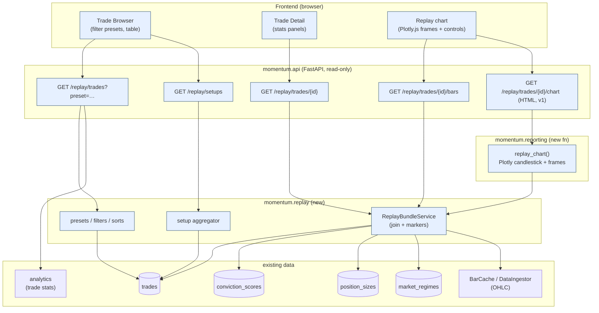
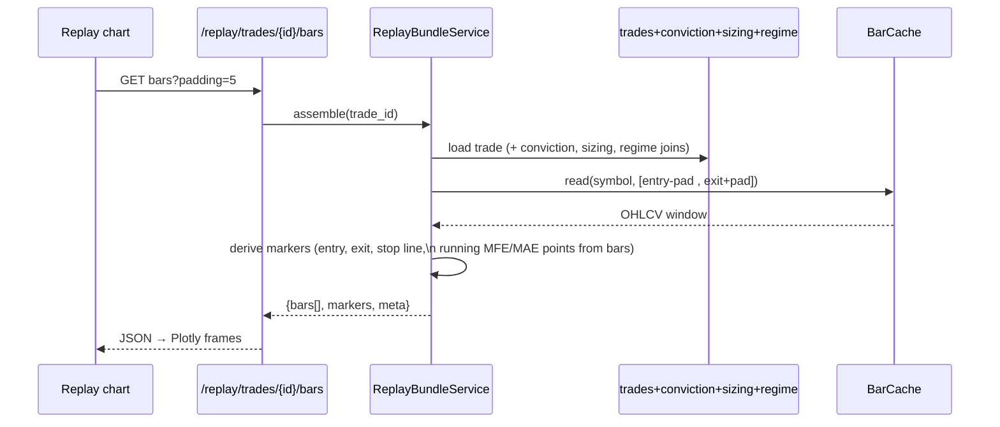

# Trade Replay — UI Wireframes & Architecture

A research surface for **reviewing completed trades**: browse/filter closed trades,
inspect the full setup-to-outcome story, and **replay the price action** bar-by-bar
with entry/exit/stop/MFE/MAE markers.

> **Status:** design (UI wireframes + architecture). No implementation yet.

## 1. The key architectural fact

Trade Replay is almost entirely a **read & presentation** layer — every field it
must show already exists in the database from earlier components:

| Required display | Already stored in |
|---|---|
| Entry / Exit (price + time) | `trades.entry_ts/entry_price`, `exit_ts/exit_price` |
| Holding period | `trades.holding_days`, `trades.bars_held` |
| Max Favorable Excursion (MFE) | `trades.mfe` |
| Max Adverse Excursion (MAE) | `trades.mae` |
| Market regime | `trades.regime_label` + `market_regimes` (trend/vol state via `regime_id`) |
| Conviction score | `conviction_scores` (linked by `trade_id`) — score, band, components |
| Position sizing | `position_sizes` (via `trades.position_size_id`) — method, shares, risk $, weight, stop |
| Exit reason | `trades.exit_reason` |
| Chart price action | the market-data cache (`BarCache` / `DataIngestor.load`) — OHLC over the holding window |
| Footer aggregates | `analytics` (`compute_trade_stats`, expectancy/profit factor) |

So no new tables or migrations are required for v1. The work is: **assemble** these
into a "replay bundle", **serve** it (read API), and **render** it (Plotly replay +
a browser UI). An optional `replay_views` table for saved filters can come later.

---

## 2. UI wireframes

### 2.1 Trade Browser (list view)

Filter presets are first-class tabs; the table is sortable and drills into a trade.

```
┌─ Trade Replay ──────────────────────────────────────────────── run: bt_2024_v3 ▼ ─┐
│  ▸ PRESETS:  [ Largest Winners ] [ Largest Losers ] [ Most Profitable Setups ]     │
│              [ Longest Holds ]                                  ( clear · custom )   │
│  Filters:  regime [all ▼]  sector [all ▼]  conviction [all ▼]  exit [all ▼]        │
│            held ≥ [__]d   R ≥ [__]        Sort ▸ [ Net P&L ▼ ]   🔍 [________]      │
├────┬────────┬─────┬───────────────┬──────┬───────┬──────────┬───────┬───────┬───────┤
│ #  │ Symbol │ Dir │ Entry → Exit  │ Held │  R    │ Net P&L  │ Conv  │ Regime│ Exit  │
├────┼────────┼─────┼───────────────┼──────┼───────┼──────────┼───────┼───────┼───────┤
│  1 │ NVDA   │  L  │ 01/04 → 02/12 │ 27d  │ +3.6R │  +$9,240 │ 92 ◆E │ bull  │ trail │
│  2 │ AAPL   │  L  │ 01/02 → 01/18 │ 12d  │ +3.1R │  +$4,100 │ 78 ◆H │ bull  │ trail │
│  3 │ SMCI   │  L  │ 01/09 → 02/01 │ 16d  │ +2.4R │  +$3,050 │ 71 ◆H │ bull  │ target│
│ …  │        │     │               │      │       │          │       │       │       │
│ 40 │ MRNA   │  L  │ 01/11 → 01/16 │  4d  │ -1.0R │   -$740  │ 51 ◦M │ neut  │ stop  │
│ 41 │ XOM    │  L  │ 01/03 → 01/05 │  2d  │ -1.0R │   -$750  │ 44 ◦M │ neut  │ stop  │
├────┴────────┴─────┴───────────────┴──────┴───────┴──────────┴───────┴───────┴───────┤
│  41 trades · expectancy +0.62R · profit factor 2.1 · win 41% · avg hold 14d         │
│                                                          [ ⟳ refresh ]  [ ⭳ CSV ]    │
└─────────────────────────────────────────────────────────────────────────────────────┘
   click a row ─────────────────────────────────────────────▶ Trade Detail (§2.2)
```

### 2.2 Trade Detail + Chart Replay

The replay chart animates the bars across the holding window; the side panels carry
every required field. Markers: ▲ entry, ◆ exit, ◇ MFE / MAE, ···· stop.

```
┌─ Trade #1 · NVDA · LONG · +3.6R ─────────────────────── [ ← back ]  [ prev ◂ ▸ next ] ┐
│ ┌─ Price replay ──────────────────────────────────────────────────────────────────┐ │
│ │  $150┤                                                   ◆ exit 142.10            │ │
│ │      │                         ◇ MFE 148.0          ╱‾‾‾‾‾                        │ │
│ │  130┤                       ╱‾‾╲      ╱‾‾╲      ╱‾‾‾                              │ │
│ │      │                  ╱‾‾‾    ╲____╱    ╲___╱                                   │ │
│ │  110┤            ╱‾‾╲ ╱                                                           │ │
│ │      │   ▲ entry 98.5                                                             │ │
│ │   95┤  ◇ MAE 95.1                                                                 │ │
│ │      │ ···· stop 92.0  (chandelier trail ·············▲·············)             │ │
│ │      └────┬───────┬───────┬───────┬───────┬───────┬───────┬───────┬──────▶ time   │ │
│ │        01/04   01/09   01/16   01/23   01/30   02/06   02/12                      │ │
│ │  [ ⏮ ] [ ◀ ] [ ▶ Play ]══════════════╪═════════════ session 18 / 27   speed [1×▼] │ │
│ │  volume ▁▂▃▅▂▃▇▅▃▂▅▆▃▂▁▃▅▇▆▃▂▃▅▂▁                                                 │ │
│ └──────────────────────────────────────────────────────────────────────────────────┘ │
│ ┌─ Setup & outcome ───────────────────────┬─ Risk, sizing & conviction ────────────┐ │
│ │ Entry      01/04 2024   $98.50          │ Position    120 sh · $11,820 · 11.8% eq │ │
│ │ Exit       02/12 2024   $142.10         │ Sizing      fixed-fractional-risk       │ │
│ │ Holding    27 sessions (39 cal. days)   │ Initial R   $750  (stop $92.00 = 2.5ATR)│ │
│ │ MFE        +148.0  (+5.0R)              │ Conviction  92 · EXTREME                │ │
│ │ MAE        −95.1   (−0.9R)              │   regime .90 · momentum .90 · sector .80│ │
│ │ Regime     bull / uptrend / normal      │   rvol .70 · breadth .60 · ATH .85      │ │
│ │ Result     +3.6R · +$9,240 (net)        │ Exit reason trailing_stop               │ │
│ │ Entry why  50-day breakout, rvol 1.8    │ Signal id   #1042 → sizing #877         │ │
│ └─────────────────────────────────────────┴─────────────────────────────────────────┘ │
└────────────────────────────────────────────────────────────────────────────────────────┘
```

### 2.3 "Most Profitable Setups" (aggregation drill-down)

This preset is an *aggregation*, not a per-trade sort: group closed trades by a setup
signature, rank by total/expected payoff, then drill into the member trades.

```
┌─ Most Profitable Setups ─────────────────────── group by [ entry_reason × regime ▼ ] ┐
│ Setup signature                     │ Trades │ Win% │ Expect │ Net P&L │ Avg hold     │
├─────────────────────────────────────┼────────┼──────┼────────┼─────────┼──────────────┤
│ 50d-breakout · bull · EXTREME       │   8    │ 62%  │ +1.9R  │ +$31,200│ 22d   ▸ drill│
│ 50d-breakout · bull · HIGH          │  14    │ 50%  │ +0.9R  │ +$18,400│ 15d   ▸ drill│
│ pullback-continuation · bull · HIGH │   6    │ 50%  │ +0.6R  │  +$5,100│ 11d   ▸ drill│
│ 50d-breakout · neutral · MEDIUM     │  13    │ 31%  │ −0.2R  │  −$2,900│  6d   ▸ drill│
└─────────────────────────────────────┴────────┴──────┴────────┴─────────┴──────────────┘
   ▸ drill ───────────────────────────────────────────▶ filtered Trade Browser (§2.1)
```

---

## 3. System architecture

Trade Replay is a thin slice composing existing platform layers. New pieces are
shaded; everything else already exists.



### Replay data assembly (one trade)



---

## 4. API contract (extends `momentum.api`)

All read-only. Reuses the `get_session` dependency and Pydantic-schema pattern.

| Endpoint | Query | Returns |
|---|---|---|
| `GET /replay/trades` | `preset`, `run_id`, `regime`, `sector`, `band`, `min_hold`, `min_r`, `sort`, `limit` | list of trade rows (browser) |
| `GET /replay/trades/{id}` | — | full **ReplayBundle** (trade + conviction + sizing + regime + signal) |
| `GET /replay/trades/{id}/bars` | `padding` (sessions), `timeframe` | `{bars[], markers, meta}` for the chart |
| `GET /replay/setups` | `group_by`, `run_id`, `metric` | aggregated setup rows (§2.3) |
| `GET /replay/trades/{id}/chart` | `padding` | server-rendered Plotly HTML (v1 fast path) |

`preset` ∈ `largest_winners | largest_losers | most_profitable_setups | longest_holds`.

**ReplayBundle (response shape)**

```jsonc
{
  "trade": { "id":1, "symbol":"NVDA", "direction":"long",
             "entry_ts":"2024-01-04T15:30Z", "entry_price":98.5,
             "exit_ts":"2024-02-12T21:00Z", "exit_price":142.1,
             "holding_days":39, "bars_held":27,
             "mfe":148.0, "mae":95.1, "r_multiple":3.6,
             "net_pnl":9240.0, "exit_reason":"trailing_stop" },
  "regime":     { "label":"bull", "trend_state":"uptrend", "volatility_state":"normal" },
  "conviction": { "score":92, "band":"extreme",
                  "components":{ "market_regime":0.9, "momentum_score":0.9, "...":0.0 } },
  "sizing":     { "method":"fixed_fractional_risk", "approved_shares":120,
                  "target_weight":0.118, "risk_dollars":750, "initial_stop":92.0 },
  "markers": {
    "entry": {"t":"2024-01-04","price":98.5},
    "exit":  {"t":"2024-02-12","price":142.1},
    "mfe":   {"t":"2024-01-31","price":148.0},   // timing derived from bars
    "mae":   {"t":"2024-01-08","price":95.1},
    "stop":  [ {"t":"2024-01-04","price":92.0}, {"t":"2024-02-12","price":138.0} ] // trail path if known
  }
}
```

---

## 5. Chart-replay design

- **Source:** the `/bars` endpoint returns the full OHLCV window (entry−padding …
  exit+padding) plus the marker set. The chart is a **candlestick + volume** built
  with Plotly.
- **Animation:** Plotly **frames** — frame *k* reveals `bars[0…k]`. As the playhead
  passes each event it reveals the marker: ▲ entry when reached, a *running* ◇MFE/◇MAE
  (high-water / low-water vs entry up to *k*), the ···· stop line, and ◆ exit on the
  final frame. Controls: ⏮ restart · ◀ step · ▶/⏸ play · scrub · speed (½×–4×) ·
  "session k / N".
- **Two render paths:**
  1. **v1 (server, fast):** Python `plotly` builds the figure with frames →
     `/chart` returns standalone HTML. Uses the existing Plotly dependency, no JS app.
  2. **v2 (client, rich):** the browser SPA consumes `/bars` JSON and drives
     Plotly.js frames itself (smoother scrubbing, shared layout with the browser).
- **MFE/MAE timing:** the DB stores MFE/MAE *magnitudes* but not *when* they occurred.
  The service **recomputes excursion timing from the bar window** (running max/min of
  price vs entry) for accurate marker placement, and reconciles the peak against the
  stored `trades.mfe/mae` (a mismatch is surfaced as a data-quality note, not a crash).

---

## 6. Filtering & sorting

| Preset | Definition (closed trades) |
|---|---|
| **Largest Winners** | `ORDER BY net_pnl DESC` (tie-break `r_multiple DESC`) |
| **Largest Losers** | `ORDER BY net_pnl ASC` |
| **Longest Holds** | `ORDER BY holding_days DESC` (then `bars_held`) |
| **Most Profitable Setups** | `GROUP BY` a setup signature → rank groups by Σ `net_pnl` or mean `r_multiple` |

Setup signature (configurable `group_by`): combinations of `entry_reason`, `regime_label`,
conviction `band`, `sector`. Secondary filters (`regime`, `sector`, `band`, `min_hold`,
`min_r`) compose with any preset. All sorts/filters run in SQL via the trades repository.

---

## 7. Module placement & components

```
src/momentum/replay/                 # new package (read/compose only)
  __init__.py
  bundle.py        # ReplayBundle dataclass + ReplayBundleService (joins + markers)
  presets.py       # preset -> (filter, sort) ; setup aggregator
src/momentum/api/routes/replay.py    # new router (extends the API layer)
src/momentum/api/schemas.py          # + ReplayBundleOut, ReplayRowOut, SetupRowOut, BarsOut
src/momentum/reporting/replay_chart.py  # replay_chart(bundle) -> Plotly Figure (frames)
web/replay/ (or api/static/)         # v1 HTML/JS browser + detail page
docs/TRADE_REPLAY.md                 # this document
tests/unit/replay/                   # service, presets, marker derivation (offline, seeded DB)
```

Dependencies point **downward only**: `replay` reads `persistence` (trades/conviction/
sizing/regime repositories) and `data` (bar cache); `reporting` renders; `api` exposes.
Nothing in the trade pipeline depends on replay — it is a pure consumer.

---

## 8. Tech choices & phased roadmap

**Stack reuse:** FastAPI (API), Plotly (charts), SQLAlchemy repositories, the bar
cache, and the analytics package — all already in the platform. v1 needs **no new
runtime dependency**.

| Phase | Deliverable | Exit criteria |
|---|---|---|
| 1 | `momentum.replay` service + `/replay/trades`, `/{id}`, `/bars` + schemas | seeded-DB tests green; bundle assembles incl. markers |
| 2 | `reporting.replay_chart` + `/{id}/chart` (server Plotly HTML) | a closed trade renders a candlestick replay with markers |
| 3 | Browser UI: filter-preset tabs + sortable table + detail view | the four presets work end-to-end over a real run |
| 4 | "Most profitable setups" aggregation + CSV export | grouped view drills into filtered trades |
| 5 (opt) | `replay_views` table for saved filters; v2 Plotly.js SPA | shareable saved views |

---

## 9. Self-critique / open questions

- **Excursion timing gap.** MFE/MAE are stored as magnitudes only; marker *timing* is
  recomputed from bars (§5). If only daily bars are cached, intraday excursions are
  approximated to the bar that contained them — fine for a daily-hold strategy, noted
  for intraday.
- **Trailing-stop path.** The initial stop is stored (`position_sizes`/`trades`); the
  *trailing* stop path over the hold is not persisted per-bar. v1 draws the initial
  stop; the trail can be reconstructed from the stop policy (`risk.stops`) if exact
  replay of the stop line is wanted.
- **Bar availability.** Replay needs cached OHLC for the symbol over the window; for a
  delisted/illiquid name the chart degrades to "bars unavailable" while the stat panels
  still render fully (they are DB-only).
- **Scope.** This is a research/review surface (read-only); it never mutates trades or
  strategy — consistent with the platform's auditability stance.
